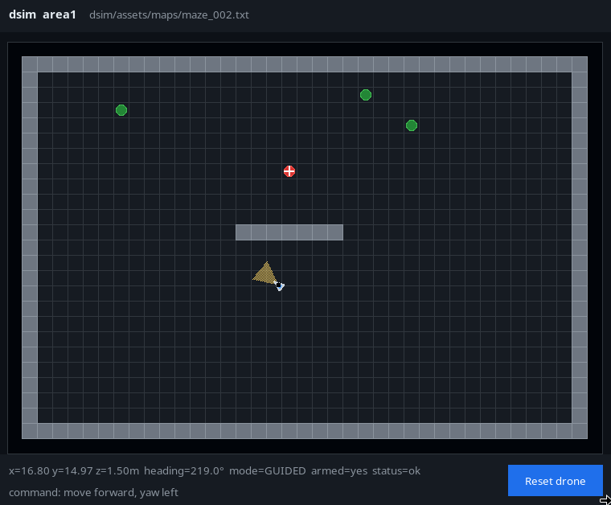
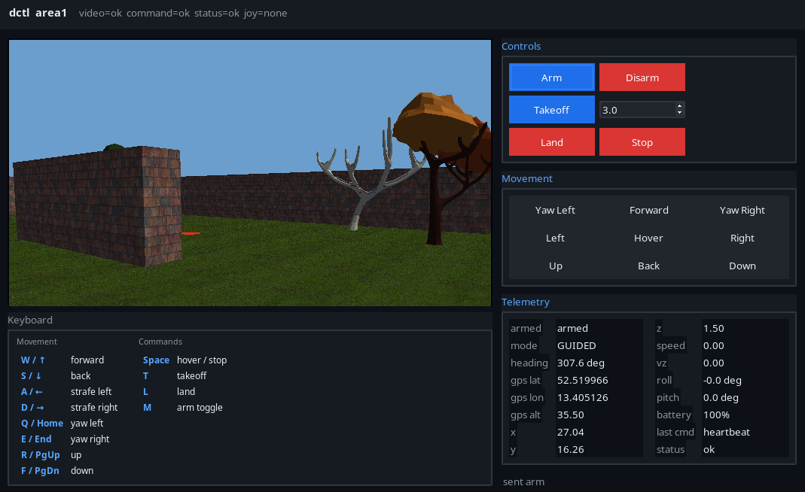
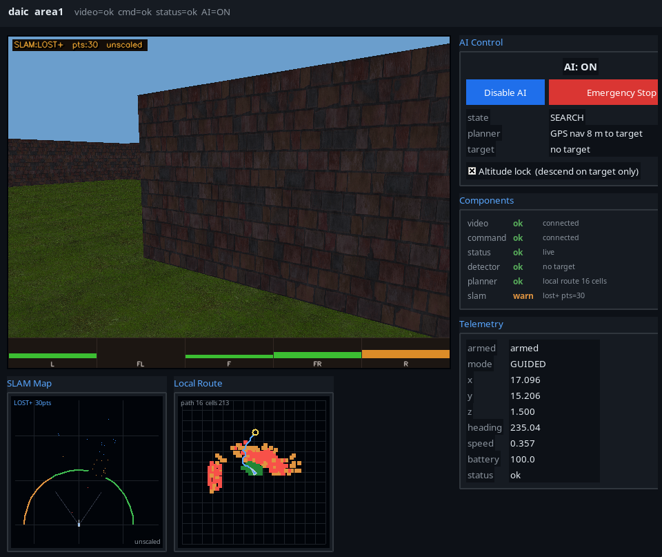

# dvision2

`dvision2` is a local drone simulation and autonomy development platform. It
contains:

- `dsim`: a Python/Panda3D drone simulator, with a simulated environment --
  GPS quality, estimator validity, wind, telemetry latency, sensor noise,
  battery and geofence -- that can be changed while it flies
- `dctl`: a manual keyboard/gamepad controller
- `daic`: a vision-driven autonomy controller
- `dway`: the autopilot client, which flies a waypoint tour and reports on it
- `dcmn`: what the windows share -- one palette, one drawing of a map

The processes communicate through shared-memory video, command, and status
buffers. The current autonomy work is intentionally centered on what a real
camera client would have: the live video stream and the status/telemetry
buffer. `daic` must not use simulator map data for navigation decisions.

The project is meant for fast local iteration. The simulator is small enough
to read, the command protocol is JSON over `pymembus` shaped so every message
maps onto a MAVLink one, and the autonomy stack is split into detector,
planner, avoidance, local mapping, and control layers so each piece can be
tested or replaced independently.

The design documents at the repository root are the contracts the code was
written against, not notes: [`DV-DWAY.md`](DV-DWAY.md) is the vehicle
interface and waypoint navigation, [`DV-DALG.md`](DV-DALG.md) the algorithm
demonstrator, [`DV-WORKBENCH.md`](DV-WORKBENCH.md) the test workbench. Change
one before writing code that diverges from it.

## Contents

- [Project Layout](#project-layout)
- [Architecture](#architecture)
- [Requirements](#requirements)
- [Quick Start](#quick-start)
- [Simulator: dsim](#simulator-dsim)
- [Manual Controller: dctl](#manual-controller-dctl)
- [AI Controller: daic](#ai-controller-daic)
- [Waypoint Navigation: dway](#waypoint-navigation-dway)
- [Vision Navigation](#vision-navigation)
- [Automated Testing and Diagnostics](#automated-testing-and-diagnostics)
- [Maps](#maps)
- [Shared Memory Protocol](#shared-memory-protocol)
- [Telemetry](#telemetry)
- [Rendering and Assets](#rendering-and-assets)
- [Development Notes](#development-notes)
- [Known Limitations](#known-limitations)

## Project Layout

```text
dvision2_common.py          Shared protocol, map loading, ids, status keys
OVERVIEW.md                 Architecture and API reference
DV-DWAY.md                  Contract: vehicle interface and waypoint navigation
DV-DALG.md                  Contract: the algorithm demonstrator
DV-WORKBENCH.md             Contract: the test workbench
docs/
  reports.md                Report layout: who owns what, and the rules
  mavlink-slam-nav.md       The reference architecture the vehicle seam borrows from

dcmn/
  theme.py                  The one dvision2 colour palette
  tktheme.py                That palette applied to ttk, shared by every window
  mapview.py                Top-down map and vehicle drawing, shared by every view

assets/                     Shared fixture data (not owned by one consumer)
  maps/                     Text map files
  textures/                 CC0 ground/wall textures
  models/trees/             CC0 tree GLB models
  tours/                    Committed benchmark tours and their diagnostics
  planner_queries/          Committed planner start/goal sidecars

dsim/
  dsim.py                   Simulator: physics, rendering, IPC server, UI
  headless.py               Fixed-timestep in-process driver with set_pose()
  range.py                  Exact renderer-aligned range core
  depth_probe.py            Measured selection of the exact-range backend
  realism.py                GPS, estimators, wind, latency, noise, battery, geofence
  realism_panel.py          The Realism tab: those settings, changeable in flight
  scene.py                  Renderer appearance presets

dctl/
  dctl.py                   Manual controller UI

daic/
  daic.py                   AI controller, UI and headless modes
  detector.py               OpenCV red target detector
  planner.py                Mission state machine
  controller.py             Target visual-servo controller
  avoidance.py              Forward-speed obstacle brake
  optical_flow_avoidance.py Dense optical-flow risk and range estimation
  local_map.py              Vision-built local occupancy map and A* route plan
  mini_slam_detector.py     Lightweight visual-motion obstacle detector
  orb_slam3_detector.py     Optional ORB_SLAM3 integration wrapper
  flight_log.py             JSONL flight logger and report analyzer
  run_reporter.py           Run summary, images and HTML for a flight

dway/
  dway.py                   Tour follower client, window and headless modes
  link.py                   VehicleLink contract and the dsim implementation
  tour.py                   Tour load/save/validate, frames, clearance
  follower.py               Arrival rules, sequencing, control strategies
  mission.py                Flight lifecycle state machine
  frames.py                 map / local NED / global transforms
  editor.py                 Map and waypoint editor, with live geometry checks
  report.py                 Flight summary, event log, track plot, repeatability

dtest/
  contract.py               Literal coordinate/sign expectations (the oracle)
  calibration_scene.py      Calibration fixture paths and image expectations
  deterministic.py          Fixed-timestep in-process dsim driver
  process_harness.py        Real-process dsim harness over the live transports
  dway_rig.py               Deterministic dway flight: real dsim, in-process transport
  conformance.py            Backend-neutral suite both harnesses must pass
  color_probe.py            Independent RGB landmark measurement
  faults.py                 Test-local fault injection for oracle self-checks
  assertions.py             High-level assertions with failure artifacts
  artifacts.py              Failure bundles (frames, timeline, path plot)
  backend.py                Normalized vehicle-backend protocol
  preflight.py              Dependency preflight for the test groups

dfgb/
  dfgb.py                   FlightGear bridge, a work in progress

tests/
  flight_test.py            End-to-end headless flight runner
  reversal_mutations.py     Audits the suite against sign/orientation reversals
  test_dvision_perception_chain.py  Render -> detector -> occupancy map, end to end
  vision_debug_report.py    Vision/map diagnostic summary from flight logs
  benchmark_diagnosis.py    Route/control cause summary + failure classification hints
  test_daic_*.py            DAIC detector, planner, map, avoidance tests
  test_dctl_controls.py     Manual control tests
  test_dsim_crash_reset.py  Simulator collision/reset tests
  test_dsim_realism_controls.py  Changing the environment while the sim runs
  test_dcmn_mapview.py      Shared map geometry, both drawing backends
  test_dcmn_theme.py        One palette, and no module keeping its own copy
  test_dvision_wall_clock_independence.py  Nothing depends on how busy the machine is
  test_dtest_harness.py     The suite's own invariants, including staying off screen
  test_dway_*.py            Vehicle contract, tours, flights, realism, editor, transports
  dway_repeatability.py     Repeated baseline flights, aggregated into variance
  benchmark_batch.py        N parallel flights of one configuration, aggregated
```

`assets/` holds fixture data owned by no single consumer: the maps every module
flies, the CC0 textures and tree models the renderer uses, and the committed
tours with their geometry diagnostics.

## Architecture

`dsim` owns the simulated world. It creates the shared-memory buffers, runs the
physics loop, renders the drone camera feed, checks collisions, and publishes
status telemetry.

`dctl`, `daic` and `dway` are clients. They connect to the same buffers,
display video and telemetry, and send commands. Clients retry missing buffers
continuously, so they can be started before or after `dsim`.

Control is leased: exactly one client owns motion, mode and arming at a time,
so three clients on one buffer cannot silently fight. A client acquires the
lease, renews it with a 1 Hz heartbeat, and gives it back on exit; the vehicle
refuses commands that do not carry it, and drops an armed vehicle into `HOLD`
when the lease expires. See [Control ownership](#control-ownership).

`dway` reaches the vehicle only through `dway.link.VehicleLink`, which is the
seam a real drone sits behind: `DsimLink` speaks the JSON protocol below, and a
`MavlinkLink` speaking pymavlink is what a real vehicle would add without
anything above the link changing. `dway` never asks whether it is talking to a
simulator -- it asks what the vehicle's published capabilities allow.

Two modules are shared rather than owned by any process. `dvision2_common.py`
is the protocol -- status keys, command encoding, map loading, report paths --
and stays free of any display dependency so headless code can import it.
`dcmn/` is the layer above it, for what a *view* shares.

`dcmn.theme` is the palette. No window module spells a colour out by hand, and
a test enforces that. `dcmn.tktheme.apply_theme` is that palette applied to
ttk, and every window calls it: a hand-built style block per window agrees on
the colours and drifts on the details, which is how a disabled button ends up
legible in one window and not the next. A window that needs more configures its
own styles on top of the shared base.

`dcmn.mapview` is the top-down map. `dsim`'s monitor, `dway`'s Fly tab, the
tour editor, `dway`'s `track.png` and `dsim`'s `flight_path.png` all draw the
same world, so they draw it from one description: the geometry lives once, in
map metres, and the backends are thin adapters -- one paints it onto a Tk
canvas, one onto matplotlib axes. A private copy per view is how the same wall
becomes light grey in one and dark in another, and how a plot quietly stops
drawing the targets.

All processes share an instance id such as `area1`. Buffer names are derived
from that id:

```text
/dvision2.area1.video     RGB24 video   dsim -> clients
/dvision2.area1.control   JSON commands clients -> dsim
/dvision2.area1.status    Telemetry k/v dsim -> clients
```

Multiple independent simulator/controller pairs can run at the same time with
different ids.

## Requirements

Required Python packages:

```text
numpy
Pillow
pymembus
panda3d
opencv-python
```

`matplotlib` is not required to fly, but without it the report images are
skipped: `dsim`'s `flight_path.png` and `dway`'s `track.png` are the two that
go missing, and both say so on stderr rather than failing the run.

The rendering and vision tests additionally need, and pin in
`requirements-visiontests.txt`, packages that can move a rendered pixel or a
measured number:

```text
panda3d-simplepbr  the shading pipeline the `representative` scene preset renders through
matplotlib         diagnostic figures
opencv-contrib     stereo and feature algorithms
```

These are pinned rather than floated because a version change here changes what
the renderer draws, and therefore what any vision algorithm is measured
against.

Optional:

```text
pygame             gamepad/joystick input for dctl
ORB_SLAM3 binding  optional full SLAM obstacle detection for daic
```

Install the common dependencies:

```sh
pip install numpy Pillow pymembus opencv-python panda3d pygame
```

Install and run with the same Python interpreter. In particular, joystick
support is unavailable when `pygame` is installed in a virtual environment but
`dctl` is launched with a different `python3`. Check the interpreter with:

```sh
python3 -c 'import sys, pygame; print(sys.executable, pygame.version.ver)'
```

`daic` also has an installer/check mode:

```sh
python3 daic/daic.py --install
```

That mode checks the OpenCV features needed by the optical-flow and mini-SLAM
paths and reports optional ORB_SLAM3 setup status.

## Quick Start

Manual control:

```sh
# Terminal 1
python3 dsim/dsim.py --id area1

# Terminal 2
python3 dctl/dctl.py --id area1
```

Autonomous flight with DAIC:

```sh
# Terminal 1
python3 dsim/dsim.py --id area1 --map assets/maps/maze_002.txt

# Terminal 2
python3 daic/daic.py --id area1 --enable-ai
```

Fly a tour:

```sh
# Terminal 1
python3 dsim/dsim.py --id area1 --map assets/maps/maze_012.txt

# Terminal 2
python3 dway/dway.py --id area1 --tour assets/tours/maze_012.forward.v1.json
```

The committed `maze_012` tours start on the far side of a wall from that map's
own drone start, and `dway` avoids nothing, so flying one from the map start is
refused by preflight. Move the vehicle onto the corridor with `dctl` first, or
fly a tour authored from where the drone actually is.

Fly a tour headless, with a wind that the vehicle has to trim out:

```sh
python3 dsim/dsim.py --id area1 --map assets/maps/maze_012.txt --no-ui --wind-mps 0.4 &
python3 dway/dway.py --id area1 --tour assets/tours/maze_012.forward.v1.json --no-ui
```

Author a tour with no simulator running at all:

```sh
python3 dway/dway.py --edit --map assets/maps/maze_012.txt
```

Headless automated run:

```sh
python3 tests/flight_test.py --map assets/maps/maze_002.txt --duration 20 --fps 20
```

Headless run with a vision diagnostic log:

```sh
python3 tests/flight_test.py --map assets/maps/maze_002.txt --duration 20 --fps 20 --log /tmp/maze002.jsonl
python3 tests/vision_debug_report.py /tmp/maze002.jsonl
```

Permanent benchmark run with route/control diagnosis (why is the drone still
in `SEARCH`? — perception miss, map noise/trap, planning miss, control stall,
or target-reacquisition miss):

```sh
python3 tests/flight_test.py --map assets/maps/maze_002.txt --duration 30 --fps 20 \
    --report-dir reports/benchmarks/<run-id>
python3 tests/benchmark_diagnosis.py reports/benchmarks/<run-id>
```

`--report-dir` writes `summary.json` (with a nested `diagnosis` block),
`diagnosis.txt`, `report.md`/`report.html`, and the occupancy snapshot gallery
together so a run can be classified without re-running anything. Confirm the
script's classification hints against the `occ_*.png` gallery — they are
heuristic pointers, not a verdict.

## Simulator: dsim



`dsim` creates the world, renders the camera image, accepts control commands,
and publishes telemetry after every tick.

```sh
python3 dsim/dsim.py --id area1 \
  --map assets/maps/maze_001.txt \
  --width 640 \
  --height 480 \
  --fps 30
```

Options:

| Option | Description |
|---|---|
| `--id` | Required instance id |
| `--map` | Map file to load |
| `--width`, `--height` | Rendered video frame size |
| `--fps` | Simulation and video update rate |
| `--bufs` | Video ring-buffer slot count |
| `--cmd-size` | Command buffer size in bytes |
| `--start-alt` | Override initial altitude; otherwise map `drone-height` or `1.5` |
| `--origin-lat/lon/alt` | GPS coordinate for the map center |
| `--start-heading` | Initial compass heading in degrees |
| `--setpoint-timeout` | Guided setpoint failsafe in seconds, default 2; `0` disables it |
| `--control-lease-timeout` | Seconds a control lease survives without a heartbeat, default 3 |
| `--max-speed-mps`, `--max-accel-mps2` | Published motion limits |
| `--scene-preset` | Renderer appearance: `representative` (default) or `legacy` |
| `--report-dir` | Write this run's reports here instead of minting a run directory |
| `--frames` | Stop after N frames, useful for tests |
| `--no-ui` | Disable the top-down simulator monitor |
| `--verbose` | Print runtime diagnostics |

The environment flags are a section of their own, below.

### Environment and Sensor Realism

Every knob below exists because a client has to behave differently when it is
switched on; a setting no client reacts to would be decoration. Their defaults
are a clean baseline -- a good 3-D fix, a valid local estimator, still air, no
delay, no sensor noise, no failsafe and no fence -- so a plain `dsim` is what
other runs are compared against. Every value is published in the status keys,
so a report can name the conditions it was flown in rather than trusting the
command line to have been remembered. `dsim/realism.py` owns the model.

| Option | Description |
|---|---|
| `--gps off\|degraded\|good\|rtk` | Fix quality; sets `gps.fix_type`, satellites and dilution, and the position noise |
| `--gps-noise-m` | Override the mode's own position noise |
| `--local-estimator on\|off` | Whether a local (VIO/SLAM/flow) position estimate exists at all |
| `--wind-mps`, `--wind-dir-deg` | Steady wind speed and the compass direction it blows *from* |
| `--wind-gust-mps` | Gust magnitude, applied as a correlated process on top of the steady wind |
| `--telemetry-latency-ms`, `--telemetry-jitter-ms` | Delay published status through a ring, so clients see the pose late |
| `--sensor-noise none\|light\|heavy` | Compass, barometer (noise plus slow drift) and velocity noise on published state |
| `--battery-failsafe-pct` | Battery percentage that triggers RTL, then LAND |
| `--battery-drain-pct-s` | Drain rate while armed |
| `--geofence x0,y0,x1,y1[,max_alt_m]` | Boundary box in map metres, with an optional ceiling |
| `--geofence-action hold\|rtl` | What crossing it does |
| `--realism-seed` | Seed for every random process, so a run reproduces |
| `--vehicle-profile <file.json>` | Defaults for any of the above; an explicit flag still wins |

Two runtime commands change the environment mid-flight, so denial can be
tested on a vehicle that is already airborne: `set_gps` (`mode`, `noise_m`)
and `set_estimator` (`attitude`, `local`, `global`, `velocity`). The simulator's
own Realism tab reaches all of these knobs, not just those two.

`Realism.apply()` is what both paths go through. It validates the whole change
before touching anything, so a rejected value leaves the environment exactly as
it was, and it re-tunes the noise processes without re-rolling them: turning the
wind up must not also teleport the gust. Changing `realism_seed` is how you ask
for the dice back.

The noise processes are correlated in time rather than white -- a fix wanders,
a barometer drifts, gusts build and fade -- because uncorrelated noise on every
sample is trivial to filter and teaches a client nothing.

**What each one buys, and how a correct client reacts**

| Condition | Vehicle behaviour | What the client must do |
|---|---|---|
| `--gps off`, local estimator on | `est.global_position_valid=0`, local stays valid | Fly on: this is the GPS-denied case, and map/local-NED tours do not need a global fix |
| `--gps off`, `--local-estimator off` | Position setpoints are refused | Refuse to fly and name `est.local_position_valid=0`; `dway` fails preflight |
| Estimator faulted mid-flight | Same, while airborne | HOLD and fail with the reason; never fly on the last known pose |
| Wind | The airframe is carried over the ground; the position loop trims it out at hover | Allow settling time: see below |
| Telemetry latency | Status arrives late, in order | Gate on pose age (`max_state_age_s`), not on arrival order |
| `--sensor-noise light` | Published pose and heading wander slightly | Nothing: `light` stays inside the committed tours' arrival gates |
| `--sensor-noise heavy` | Wander exceeds those gates | Widen the tour's own gates; the follower never widens them silently |
| Battery below the failsafe | RTL, then LAND, keeping `failsafe.reason=battery_low` | Stop commanding, report the failsafe |
| Geofence, `hold` | HOLD with `failsafe.reason=geofence`; targets outside are refused outright | Fail with the reason |
| Geofence, `rtl` | RTL, then LAND, same reason | Fail with the reason |

**Wind and the position controller.** A purely proportional approach parks at
an offset of exactly the disturbance divided by its gain, so in any wind at all
it hovers downwind of the setpoint and never satisfies an arrival gate. Both
loops -- the one `dsim` runs onboard and the external one `dway`'s velocity
backend closes -- therefore carry a trim term, accumulated only within a metre
of the target and below hover speed, because during an approach the error is
distance still to travel rather than disturbance and integrating it overshoots
the waypoint.

The measured consequence on `maze_012.forward.v1`, whose legs are 8 m at 1 m/s
with a 0.05 m tolerance:

| Steady wind | Outcome |
|---|---|
| 0.4 m/s | Arrives within the default `max(10 s, 3 x distance / speed)` leg timeout |
| 0.8 m/s | Trims out and arrives, but after roughly 35 s; the default leg timeout expires first, so the tour must set `leg_timeout_s` |
| 1.2 m/s and above | Cross-track drift during travel exceeds this corridor's clearance and the vehicle hits a wall |

A tour therefore has a wind ceiling set by its own clearance, and a wind budget
set by its own `leg_timeout_s`. Neither is adjusted for it silently.

The simulator uses a simple first-order response model:

| Axis | Time constant |
|---|---|
| Horizontal forward/right | 0.30 s |
| Vertical up/down | 0.35 s |
| Yaw rate | 0.10 s |
| Visual roll/pitch | 0.14 s |

`forward_mps`, `right_mps`, and `up_mps` are actual SI velocity setpoints.
`yaw_rate_dps` is degrees per second. Positive yaw is a right/clockwise turn
and increases compass heading. Attitude follows the aviation convention shared
with the FlightGear bridge: `drone.roll_deg` is positive for a right-wing-down
bank (a right strafe banks right) and `drone.pitch_deg` is positive nose-up (so
forward flight pitches nose down).

Collision is cell based: wall and tree objects occupy their full map cell, and
a crash puts the drone in `CRASHED` until reset.

### Monitor window

Two tabs. The status line, Save Snapshot and Reset drone sit outside them,
because they are about the vehicle whichever page you are reading.

**Map** is the top-down monitor: the map, the drone's position and heading, its
view cone, and the armed/mode state.

**Realism** is every environment knob from the section above, as a form, and it
takes effect on the running simulation. That is the point of it: a fault is far
more informative switched on against a vehicle that is already flying -- deny
GPS mid-leg, raise the wind while a controller is holding station, narrow the
fence under a drone -- and none of that is reachable from a flag you had to
choose before takeoff. Editing a field and pressing Enter applies it, as does
picking from a dropdown; a rejected value says why and changes nothing.

The Estimators row is the runtime fault switch, the same one the `set_estimator`
command reaches. Unticking one faults that estimator; what is actually valid
right now is in the readout underneath, which is a different question -- a 2-D
fix invalidates the global estimate without anybody having faulted it.

Nothing here is persisted. The command line stays the record of how a run
started, and **Reset to command line** puts it back, faults included.

The form is taller than the map, so it scrolls inside a viewport the height of
the map canvas: a notebook is as tall as its tallest page, and without that the
realism tab would set the height of the whole window and push the monitor down
the screen. The wheel scrolls the page even over a combobox, which ttk would
otherwise spin -- a scroll aimed at the page must not silently edit a setting.

### Report Layout

`dsim` owns the report directory for a run and publishes it as the
`sim.report_dir` status key. Every other module reads that key and writes into
its own subdirectory, so a run's pieces stay together and no component has to
agree a name with any other:

```text
reports/<id>/<timestamp>-<random>/
  dsim/     simulator flight path, snapshots, summary.json
  daic/     controller occupancy snapshots, route log, frames, summary.json
  dway/     flight summary.json, flight.jsonl, track.png
  <module>/ any other client, named after itself
```

The instance id comes first so two instances running side by side --
`--id area1` and `--id area2` -- produce two trees instead of one interleaved
list. The run name is a local timestamp for sorting plus eight random hex
characters, so two runs started in the same second cannot collide. A run
started without an id lands under `reports/default/`.

`--report-dir <path>` overrides the whole thing and writes directly to the
named directory, which is how the test harnesses pin a run to a known place.

`dvision2_common.report_root()` and `new_run_id()` define this layout; a new
module should call them rather than build a path of its own.
[`docs/reports.md`](docs/reports.md) is the full contract: ownership, what each
module writes, and the rules a new module follows.

## Manual Controller: dctl



`dctl` is the manual pilot. It displays the camera feed and sends velocity,
arm, takeoff, land and zero commands.

```sh
python3 dctl/dctl.py --id area1 \
  --width 960 \
  --height 720 \
  --fps 30
```

Options:

| Option | Description |
|---|---|
| `--id` | Required instance id |
| `--width`, `--height` | Maximum displayed video size |
| `--fps` | UI refresh rate |
| `--cmd-size` | Command buffer size |
| `--speed` | Horizontal speed sent to dsim in m/s |
| `--vertical-speed` | Vertical speed sent to dsim |
| `--no-joystick` | Disable gamepad polling |
| `--verbose` | Log commands to stdout |

Keyboard controls:

| Key | Action |
|---|---|
| `W` / Up | Move forward |
| `S` / Down | Move back |
| `A` / Left | Strafe left |
| `D` / Right | Strafe right |
| `R` / Page Up | Move up |
| `F` / Page Down | Move down |
| `Q` / Home | Yaw left |
| `E` / End | Yaw right |
| `Space` | Hover / zero velocity |
| `T` | Takeoff |
| `L` | Land |
| `M` | Arm/disarm toggle |

Gamepad controls use an Xbox-style layout:

| Control | Action |
|---|---|
| Left stick X/Y | Strafe / forward-back |
| Right stick X/Y | Yaw / up-down |
| A | Hover |
| B | Land |
| X | Arm toggle |
| Y | Takeoff |
| Back | Disarm |
| Start | Arm |

Manual yaw is intentionally normalized so joystick and keyboard yaw directions
match the UI labels and simulator heading behavior.

**Control ownership.** The vehicle takes commands from one client at a time, so
`dctl` claims the lease on connect and renews it once a second while it is
running. The Controls panel has **Take Control** and **Release Control** for
the case that matters: handing the vehicle to `dway` for a tour and taking it
back afterwards. The telemetry panel shows who currently holds it, and a failed
acquire names the holder rather than failing silently.

Because the guided setpoint failsafe is on by default, a `dctl` that stops
sending velocity -- all keys released, no stick input -- lets the vehicle fall
into `HOLD` after `--setpoint-timeout` seconds. That is the intended behaviour:
a heartbeat deliberately keeps the lease alive without keeping a stale setpoint
alive. `dctl` holds its last velocity only while an input is actually held.

## AI Controller: daic



`daic` is the autonomous client. It reads only the video and status buffers,
then sends commands through the command buffer. It can run with a Tk UI or in
headless mode for automated testing.

Like `dctl` it acquires the control lease and heartbeats while connected, and
re-acquires it if something else took the vehicle; it never sends motion
commands without holding it.

```sh
# UI, manual AI toggle
python3 daic/daic.py --id area1

# UI, autonomy enabled immediately
python3 daic/daic.py --id area1 --enable-ai

# Headless
python3 daic/daic.py --id area1 --enable-ai --no-ui

# Log every control tick
python3 daic/daic.py --id area1 --enable-ai --log-file /tmp/flight.jsonl
```

Options:

| Option | Description |
|---|---|
| `--install` | Check/install DAIC vision dependencies, then exit |
| `--id` | Instance id; required unless `--install` is used |
| `--display-w`, `--display-h` | Maximum displayed video size, `0` for native |
| `--video-w`, `--video-h` | Expected frame size for detector/servo gains |
| `--fps` | UI/control loop refresh rate |
| `--cmd-size` | Command buffer size |
| `--enable-ai` | Enable AI immediately on startup |
| `--no-ui` | Headless mode |
| `--log-file` | Write structured JSONL flight log |
| `--slam-vocab` | Path to `ORBvoc.txt`; enables ORB_SLAM3 obstacle detection |
| `--slam-settings` | Optional ORB_SLAM3 YAML; generated from camera status when omitted |
| `--verbose` | Print planner state each tick |

### Controller window

The DAIC window is arranged around the live camera feed. The video is displayed
with target and obstacle overlays. The SLAM/map panels sit under the video so
the window stays reasonably wide instead of becoming excessively tall.

The control side panel contains:

- AI enable/disable state
- Emergency stop
- Current mission state
- Planner status text
- Target detection readout
- Altitude lock
- Component health for video, command, status, detector, SLAM/flow, and planner
- Telemetry such as armed state, mode, position, heading, speed, and battery

Altitude lock is enabled by default. Outside active landing it prevents DAIC
from sending vertical velocity commands, which keeps route-planning tests from
accidentally mixing horizontal navigation with altitude changes.

### Mission State Machine

DAIC's mission planner handles arming, search/transit, target approach, and
landing:

```text
IDLE -> ARMING -> SEARCH -> APPROACH -> LANDING -> COMPLETE
                  ^            |
                  |            |
                  +-- target lost

any state -> FAILSAFE on stale telemetry, low battery, timeout, or crash
```

During `SEARCH`, DAIC primarily navigates toward the target GPS position from
the status buffer. When local vision mapping has an available route, the GPS
transit command is replaced by the local route command.

During `APPROACH` and `LANDING`, the red target detector and visual-servo
controller take over. The target controller approaches before it descends: it
keeps forward motion while the target is small/far, then descends only once the
target is large enough and below the camera center.

## Waypoint Navigation: dway

`dway` is the autopilot client. It loads a tour, negotiates with the vehicle
how the tour can be flown, streams setpoints, advances on arrival, and writes a
flight report. `dctl` is the manual pilot and `daic` is the vision experiment;
`dway` is the one that flies a plan.

```sh
# Terminal 1
python3 dsim/dsim.py --id area1 --map assets/maps/maze_012.txt

# Terminal 2
python3 dway/dway.py --id area1 --tour assets/tours/maze_012.forward.v1.json
```

Options:

| Option | Description |
|---|---|
| `--id` | Required instance id, shared with the simulator |
| `--tour` | Tour JSON file to fly |
| `--strategy` | `auto` (default), `position`, or `velocity` to force a backend |
| `--speed` | Override the tour's `default_speed_mps` |
| `--stream-hz` | Setpoint stream rate, default 10 |
| `--finish-action` | `land` (default), `hold`, or `rtl` after the last waypoint |
| `--wait-for-start` | Stay in `READY` until Start is pressed |
| `--client-id` | Control-lease identity, default `dway-<id>` |
| `--ack-timeout` | Seconds to wait for a command acknowledgement, default 1 |
| `--timeout` | Abort the flight after this many seconds |
| `--exit-on-finish` | Close the window when the flight ends |
| `--no-ui` | Run headless, for scripted flights |
| `--edit` | Open the tour editor alone, with no vehicle and no `--id` |
| `--map` | Map to open in `--edit` mode |

```sh
# Author a tour without a simulator running at all
python3 dway/dway.py --edit --map assets/maps/maze_012.txt
```

### Follower window

Three tabs, and the window is optional -- `--no-ui` has been there from the
start so scripted flights need no display.

**Fly** draws the map with the tour on it, the vehicle and its heading, the
current target and the leg to it, progress through the waypoints with the
dwell countdown, live telemetry, and the strategy that was selected together
with the capability facts that chose it. Start, pause, resume, hold, RTL and
land are there; a control the mission or the vehicle refuses says so rather
than appearing to do nothing.

**Vehicle** is the page to open when the drone will not fly. It names the one
fact preventing flight -- a missing capability, an invalid estimator, a stale
pose, another client holding the lease, or an active failsafe -- checked in the
order in which each would stop a flight, and then shows the negotiated
capability profile, fix type and satellites, estimator validity, setpoint age,
control ownership, battery, wind and geofence. It answers "why not" without
reading a log.

**Tour editor** (`dway/editor.py`) opens a map, places and drags waypoints,
rotates each one's heading by dragging its arrow, and edits the tour's speed,
tolerance and clearance. It shows live geometry -- path length, longest
straight run, per-leg clearance -- and measures **leg zero from the map's own
start pose**, because a tour whose first leg is unflyable otherwise looks fine
in an editor. Saving writes the file and immediately reads it back through the
loader: saving is not the same as being loadable. `dalg` imports this tab
rather than growing one of its own.

All three tabs draw the map through `dcmn.mapview`, so a wall, a tree, a target
and the vehicle look the same here as they do in `dsim`'s own monitor. What
`dway` adds on top -- the planned route, waypoint numbers, the current leg and
the flown track -- is its own.

### The vehicle seam

`dway` never asks whether it is talking to a simulator. Everything goes through
`dway.link.VehicleLink`: capabilities, state, control lease, arm, takeoff,
land, RTL, hold, and the two setpoint types. `DsimLink` speaks the JSON
protocol below; a `MavlinkLink` speaking pymavlink is what a real vehicle would
add, and nothing above the link would change.

Control is leased. `dway` acquires the lease before it arms anything, renews it
with a 1 Hz heartbeat, and gives it back on exit. A heartbeat renews the lease
but deliberately does **not** refresh the vehicle's setpoint timer, so a client
that stops flying but keeps saying hello still fails safe.

Every command carries a request id and waits for the matching result. Queue
admission is not acceptance: a lease check or a mode check can still refuse a
setpoint, and a refusal ends the flight with the reason rather than being
retried.

### Tours

A tour is a file in the repository -- there is no store and no database. The
loader accepts a single tour object with `status` absent or `applicable`, at
least one waypoint, and a supported `schema_version`; it rejects the aggregate
`diagnostics.v1.json` and every `not_applicable` tour with a reason.

| Field | Meaning |
|---|---|
| `coordinate_frame` | `map` (default), `local_ned`, or `global` |
| `waypoints` | `{x,y,z}`, `{north_m,east_m,down_m}`, or `{lat_deg,lon_deg,alt_m}` plus `heading_deg` and `dwell_s` |
| `map`, `map_sha` | Map the tour was authored against; the hash is checked before control is acquired |
| `waypoint_tolerance_m` | Arrival distance gate |
| `arrival_speed_mps` | Arrival speed gate, default 0.15 |
| `heading_tolerance_deg` | Arrival heading gate, default 5 |
| `max_state_age_s` | Oldest pose that may be flown on, default 0.5 |
| `leg_timeout_s` | Overrides the default `max(10 s, 3 x distance / speed)` |
| `min_clearance_m` | Clearance a leg is expected to keep from map geometry |
| `geo_anchor` | `origin_lat_deg`, `origin_lon_deg`, `origin_alt_m`, `rotation_deg` -- where a map-frame tour sits on the Earth |

Map X is east-positive, map Y is south-positive, map Z is metres above map
ground. The local-NED origin is the published geographic origin at the centre
of the map:

```text
east_m  = x - width/2
north_m = height/2 - y
down_m  = -z
```

Compass heading is unchanged between those two frames. `geo_anchor.rotation_deg`
is the clockwise angle from map north to true north, applied to the
`(east, north)` vector and to headings before projecting to WGS84.
`dway/frames.py` owns both directions of every conversion.

Preflight measures the clearance of every leg **including leg zero**, the
movement from wherever the vehicle currently is to the first waypoint. A leg
that passes through map geometry is refused outright -- `dway` flies the tour it
was given and avoids nothing. A leg that merely passes closer than the tour's
`min_clearance_m` is reported as a warning in the log and the report, because
several committed tours legitimately fly lines that tight. Note that the
`maze_012` tours start on the far side of a wall from that map's own drone
start, so flying one from the map start is refused; move the vehicle onto the
corridor first.

### Following

Sequencing happens off-vehicle: publish the current target continuously,
advance only on arrival. A sample is inside the arrival gate when the 3-D
distance, the total speed and the wrapped heading error are all within their
tolerances, and all three must stay true continuously for the waypoint's
`dwell_s`. Leaving the gate resets the dwell clock, and a zero-dwell waypoint
advances on the first in-gate sample rather than being flown through.

The strategy is chosen from capabilities, never from the vehicle's identity:

```text
accepts_position_target      -> stream position targets
else accepts_velocity_target -> close the position loop here, send velocity
else                         -> refuse to fly, and say which capability is missing
```

The stream must be faster than twice the vehicle's advertised setpoint timeout
or preflight refuses the configuration.

### Flight lifecycle

```text
DISCONNECTED -> PREFLIGHT -> READY -> ARMING -> TAKING_OFF -> FLYING
                                      |                         |
                                      +-> FAILED <--------------+
FLYING <-> PAUSED -> COMPLETING -> LANDING -> COMPLETE
   |          |            |
   +----------+----------> RTL -> LANDING
```

Preflight validates the tour and the map hash, reads capabilities and a fresh
state, selects a strategy, checks clearance, and acquires control. Takeoff is
skipped when the vehicle is already airborne. Pause commands HOLD and stops the
mission clock; resume revalidates health, reacquires control if it was lost,
and restreams. A rejected command, a lost lease, a crash, stale state, an
invalid estimator or a leg timeout enters `FAILED` with the exact reason and
never retries. `SIGINT` or closing the window commands HOLD, writes a partial
report and releases control -- it does not disarm an airborne vehicle.

### Report

`<sim.report_dir>/dway/` holds `summary.json` (versioned; per-waypoint arrival
times, dwell, overshoot and cross-track error, path length, failsafes,
`partial`, and a `conditions` block naming the environment the run was flown
in), `flight.jsonl` (one line per command and event, with the request and
result ids and a state snapshot) and `track.png` (planned versus flown, over
the same map the live windows draw, with the legend in the lower right).

### Repeatability

`dalg`'s premise is that a tour is a predictable stimulus, so how repeatable
closed-loop following actually is had to be measured rather than assumed.
`tests/dway_repeatability.py` flies one baseline tour N times through real
`dsim` and `dway` processes with realism off and aggregates the runs:

```sh
python3 tests/dway_repeatability.py --runs 5
```

It writes `reports/dway-repeatability/<name>/repeatability.json` -- run count,
mean and variance of path length, and mean and variance of each waypoint's
arrival time.

Five runs of the two-waypoint `maze_012` corridor tour, 13 m of path at
1 m/s:

| Measure | Mean | Variance | Spread |
|---|---|---|---|
| Path length | 13.056 m | 2.2e-5 m² | ~5 mm, 0.04% of path |
| Waypoint 0 arrival | 8.919 s | 1.9e-3 s² | ~43 ms |
| Waypoint 1 arrival | 16.291 s | 2.6e-3 s² | ~51 ms |

Millimetres of path and tens of milliseconds of timing across whole flights, so
closed-loop following is repeatable enough to be a stimulus and the open-loop
tour-player fallback is not needed. Numbers are from one machine; rerun the
harness rather than trusting these on another.

## Vision Navigation

DAIC's obstacle/navigation stack is deliberately vision-first. It may use:

- RGB video frames from the video buffer
- telemetry/status values such as pose, velocity, heading, camera intrinsics,
  and target GPS

It must not read `dsim` map files or simulator object lists to decide where to
fly. Map files are for the simulator and tests only.

### Processing Pipeline

```text
RGB frame + status
      |
      +--> red target detector
      |
      +--> mini-SLAM / optical-flow obstacle detection
                 |
                 v
          fused obstacle sectors
                 |
                 v
        local occupancy map
                 |
                 v
          A* local route
                 |
                 v
       planner command + avoidance brake
```

### Obstacle Sectors

Obstacle detectors emit five sector risks:

```text
left, front_left, front, front_right, right
```

Each sector risk is `0.0` for clear and `1.0` for fully blocked. Sectors also
carry optional range estimates such as `front_range_m`. The fused sector result
takes the maximum risk from available detectors and the nearest range estimate
for each sector.

### Optical Flow and Range

`daic/optical_flow_avoidance.py` computes dense Farneback optical flow between
successive video frames. Radial expansion from the image center indicates that
the drone is moving toward visible structure.

The detector now estimates range using time-to-contact:

```text
range ~= forward_speed * dt / radial_expansion_ratio
```

The implementation uses body-forward speed from `drone.vx_mps`,
`drone.vy_mps`, and `drone.heading_deg`, then applies conservative clipping
and a calibration gain for the dsim camera geometry. The bottom of the frame is
ignored for range estimation because the pitched camera sees the floor; using
that region directly makes every wall appear extremely close.

Range is not available when the drone has too little forward motion or when
the optical-flow field is too weak. In that case the local map falls back to a
default projection distance.

### Local Occupancy Map

`daic/local_map.py` maintains a rolling occupancy grid around the drone. It:

- decays stale cells over time
- marks a short free-space fan in front of the drone
- projects obstacle sectors into world-frame grid cells
- uses per-sector range estimates when available
- falls back to a default projection distance when range is unavailable
- plans a local A* path to the status-derived target position

The route follower converts the next lookahead waypoint into forward velocity
and yaw-rate commands. It is intentionally damped so the drone can move while
turning moderately instead of spinning in place at every waypoint.

### Avoidance Brake

`daic/avoidance.py` is the last safety layer before sending velocity commands.
It does not inject lateral movement or yaw. It only trims forward speed when
front-sector risk is high. That keeps steering under the route planner while
still reducing forward motion into detected obstacles.

## Automated Testing and Diagnostics

Run all tests:

```sh
pytest -q
```

Install and verify the pinned vision-test environment:

```sh
python3 -m pip install -r requirements-visiontests.txt
python3 -m dtest.preflight
```

`dtest.preflight` reports the `deterministic`, `rendering`, and `process`
dependency groups separately. If rendering or IPC support is missing, those two
test groups are skipped from collection and the run header says so; the
deterministic physics and coordinate contract tests always run.

Run only the deterministic coordinate/video contract:

```sh
pytest -q tests/test_dvision_coordinate_contract.py \
  tests/test_dvision_calibration_render.py
```

Run the real-process command/status/video and DAIC integration checks:

```sh
pytest -q tests/test_dvision_process_transport.py
```

The process harness allocates a unique IPC ID per test, waits on readiness and
status conditions rather than fixed startup sleeps, records failure frames and
telemetry, and removes shared-memory resources during cleanup. The DCTL GUI
smoke case uses `xvfb-run` when a virtual display is available.

`dtest/conformance.py` holds the backend-neutral suite. It runs against the
in-process deterministic simulator and the real DSIM process today, and is what
a future MAVLink backend must pass.

For CI artifact upload, point failure bundles at a persistent directory:

```sh
DVISION_TEST_ARTIFACTS=/path/to/ci-artifacts pytest -q
```

A failure bundle contains the initial and final raw frames, an annotated frame
showing observed centroids against expected regions, the commands sent, a
pose/velocity/heading/epoch/frame-sequence timeline, a top-down path plot when
the drone moved, the fixture and camera parameters, and a `result.json`
summary. These are diagnostics; the assertions themselves are the oracle.

Run the opt-in longer calibration stream (20 seconds by default):

```sh
DVISION_NIGHTLY=1 pytest -m nightly -q
```

Set `DVISION_NIGHTLY_SECONDS` to change its duration. The CI/scheduler should
retain `DVISION_TEST_ARTIFACTS` when a job fails.

Run the end-to-end perception chain (rendered pixels → detector → occupancy
map):

```sh
pytest -q tests/test_dvision_perception_chain.py
```

Each link in that chain is unit-tested in isolation, which is not the same as
testing the chain: a convention can be applied consistently *within* two stages
and still disagree *between* them. These tests fly the real detector over real
rendered frames and ask where the obstacle ended up in world coordinates. The
left/right fixtures are mirror images, so a handedness error has to change the
answer's sign rather than merely shift it.

### Reversal audit

Sign and orientation bugs are the failure mode this project hits most: the data
is well-formed and only its *interpretation* is mirrored, so a test that merely
asserts "something happened" passes straight through. `tests/reversal_mutations.py`
measures whether the suite actually notices. It injects one reversal at a time
into a production file, runs the suite, and reports whether anything failed:

```sh
python3 tests/reversal_mutations.py            # audit every catalogued reversal
python3 tests/reversal_mutations.py --list     # show the catalogue
python3 tests/reversal_mutations.py -k slam    # only matching mutations
```

A `MISSED` row is the useful output: it names a boundary where a mirrored axis
or an inverted sign would ship silently. The script exits non-zero if anything
is missed, so it can gate a merge. Target files are backed up to a temporary
directory and restored in a `finally` — including on Ctrl-C — and the restore
is verified by digest.

Add a case to the `MUTATIONS` catalogue whenever a new coordinate, sign, or
image-orientation boundary appears. An `ANCHOR` row means the catalogue snippet
no longer matches the code and needs updating.

Run a headless mission:

```sh
python3 tests/flight_test.py
```

Useful options:

| Option | Description |
|---|---|
| `--map` | Map file relative to the project root |
| `--duration` | Maximum flight time in seconds |
| `--fps` | Simulation FPS and frame-budget basis |
| `--log` | JSONL log path; defaults to `/tmp/daic_flight_<ts>.jsonl` |
| `--verbose` | Print subprocess diagnostics |

Example:

```sh
python3 tests/flight_test.py \
  --map assets/maps/maze_002.txt \
  --duration 20 \
  --fps 20 \
  --log /tmp/maze002.jsonl
```

The test runner:

1. launches `dsim` with `--no-ui --frames N`
2. waits for buffers to exist
3. launches `daic` with `--no-ui --enable-ai --log-file`
4. waits for the simulator budget to finish
5. terminates DAIC
6. analyzes the log
7. exits `0` on a successful landing and `1` otherwise

### Flight Logs

DAIC logs one JSON record per control tick. A tick contains mission state,
planner status, target detection, command fields, telemetry, and vision
diagnostics:

```json
{
  "t": 0.351,
  "state": "SEARCH",
  "status": "GPS nav 9 m to target",
  "det": {"visible": false},
  "cmd": {"type": "velocity", "forward_mps": 0.45, "yaw_rate_dps": 0.0},
  "telem": {"drone.x_m": "17.500", "drone.y_m": "16.490"},
  "vision": {
    "fused": {
      "method": "flow:expansion+persist",
      "front": 0.35,
      "front_range_m": 1.54
    },
    "local_map": {
      "occupied_cells": 11,
      "front_occ_m": 1.99,
      "default_obstacle_projection_m": 3.0
    }
  }
}
```

Use the diagnostic report to inspect whether perception and mapping agree:

```sh
python3 tests/vision_debug_report.py /tmp/maze002.jsonl
```

The report highlights:

- ticks with front/front-left/front-right obstacle risk
- fused sector risk values
- estimated sector ranges
- nearest and front occupied map cells
- occupied/free cell counts
- whether the map had to fall back to the default projection distance

This is the fastest way to debug cases where the drone appears to see a wall
but the planner behaves as if it is trapped or as if the wall is at the wrong
distance.

## Maps

Maps are plain text files with three sections:

```text
--- DATA
drone-height=1.5

--- VARS
+=drone
*=target
0=wall
1=tree

--- MAP
000000
0    0
0 +* 0
0    0
000000
```

`DATA` contains key/value settings. `drone-height` sets the starting altitude.

`VARS` maps characters to object kinds.

`MAP` is an ASCII grid. Each character is one simulated meter. Columns are
local `x`, rows are local `y`, and object centers are at cell centers. Exactly
one drone start cell (`+`) is required.

Built-in symbols:

| Symbol | Kind | Rendered as |
|---|---|---|
| `+` | drone | Start position |
| `*` | target | Red ground marker |
| `0` | wall | Brick-textured box, 2.5 m tall |
| `1` | tree | GLB tree model or primitive fallback |
| space | empty | Traversable floor |

Included maps:

| File | Description |
|---|---|
| `maze_001.txt` | Default challenge map |
| `maze_002.txt` | Corridor/interior-wall navigation case |
| `maze_003.txt` | Additional layout |
| `maze_012.txt`, `maze_013.txt`, `maze_014.txt` | The layouts the committed tours are authored against |
| `test_direct.txt` | Open field, no obstacles |

Test fixtures, which are maps but are not meant to be flown for fun:

| File | Purpose |
|---|---|
| `calibration_orientation.txt`, `calibration_orientation_ring.txt` | Coloured landmarks at known bearings, the render/orientation oracle |
| `chain_front_obstacle.txt`, `chain_left_obstacle.txt`, `chain_right_obstacle.txt` | One obstacle in one place, for the perception chain; left and right are mirror images so a handedness error changes the answer's sign |
| `range_chirality.txt` | Asymmetric geometry that catches a mirrored range backend |

### Committed tours

`assets/tours/` holds committed waypoint tours for `maze_001` and `maze_012` to
`maze_014`, in six archetypes: `forward`, `strafe`, `yaw_only`, `orbit`,
`boustrophedon` and `stop_and_stare`. `diagnostics.v1.json` is the aggregate
geometry record for the set; it is not itself flyable, and `dway`'s loader
rejects it with a reason, as it does any tour marked `not_applicable`.

The tour format, its coordinate frames and its arrival gates are described
under [Waypoint Navigation](#waypoint-navigation-dway).

## Shared Memory Protocol

All buffers are provided by `pymembus` and named as:

```text
/dvision2.<id>.<channel>
```

| Buffer | Channel | Direction | Type |
|---|---|---|---|
| Video | `.video` | dsim -> clients | `memvid` RGB24 ring buffer |
| Command | `.control` | clients -> dsim | `memcmd` text queue |
| Status | `.status` | dsim -> clients | `memkv` key-value store |

### Commands

Commands are compact JSON objects:

```json
{"magic":"dvision2.command.v1","type":"velocity","source_id":"dway-area1","lease_id":"1f3c...","request_id":"9ab2...","forward_mps":0.8,"right_mps":0.0,"up_mps":0.0,"yaw_rate_dps":0.0}
```

The `magic` field is a version gate. Commands with the wrong magic or missing
type are ignored.

| Type | Fields | Effect |
|---|---|---|
| `acquire_control` | none | Claim the control lease; refused while another client holds it |
| `release_control` | none | Give the lease back |
| `heartbeat` | none | Renews the lease; does **not** refresh the setpoint timer |
| `arm` | `armed` | Arms/disarms; arming captures home, disarm zeroes motion |
| `takeoff` | `alt_m` | Climb to target altitude |
| `land` | none | Descend and disarm on touchdown; allowed without a lease |
| `rtl` | none | Climb to a safe height, return to home, then land |
| `zero`, `hold` | none | Clear every setpoint; enter HOLD if armed |
| `velocity` | `forward_mps`, `right_mps`, `up_mps`, `yaw_rate_dps` | Body-frame velocity setpoint |
| `position_target` | `frame` plus `x,y,z` or `north_m,east_m,down_m`, `heading_deg`, `max_speed_mps` | Position setpoint the simulator flies to |
| `set_origin` | `lat_deg`, `lon_deg`, `alt_m` | Move the geographic origin; disarmed only |
| `set_gps` | `mode`, `noise_m` | Deny or restore GPS mid-flight; simulation only |
| `set_estimator` | `attitude`, `local`, `global`, `velocity` | Fault or restore an estimator; simulation only |
| `reset` | none | Return the vehicle to its start pose |

### Control ownership

There is one active controller. `acquire_control` creates a lease; every
motion, mode and arming command must carry the current `source_id` and
`lease_id` or it is refused. Heartbeats from the owner renew the lease;
anything else does not. The lease expires after `--control-lease-timeout`
seconds (default 3), which puts an armed vehicle into `HOLD`. An emergency
`land` is accepted without a lease.

Every command carries a `request_id`, and its outcome is published in
`command.result.request_id` / `.accepted` / `.reason`. Queue admission is not
acceptance -- streamed setpoints wait for their result too.

`--setpoint-timeout` (default `2` seconds; `0` disables it) is the guided-mode
failsafe: an armed vehicle in `GUIDED` that stops receiving position or
velocity targets clears them, enters `HOLD`, and publishes
`failsafe.reason=setpoint_timeout`. `TAKEOFF`, `LAND`, `RTL`, `HOLD` and
`DISARMED` are not subject to it. A heartbeat renews the control lease and
deliberately does not refresh this timer, so a client that stops flying but
keeps saying hello still fails safe.

`dctl`, `daic` and `dway` all acquire a lease and send heartbeats while
connected.

### MAVLink mapping

The JSON stays honest by being mappable one-for-one onto MAVLink. Where a row
has no equivalent it is simulation-only, and a future bridge must not pretend
to translate it.

| dsim JSON | MAVLink equivalent | Notes |
|---|---|---|
| `arm` | `MAV_CMD_COMPONENT_ARM_DISARM` | |
| `takeoff` | `MAV_CMD_NAV_TAKEOFF` | altitude only |
| `land` | `MAV_CMD_NAV_LAND` | |
| `rtl` | `MAV_CMD_NAV_RETURN_TO_LAUNCH` | |
| `position_target` (`frame:"local_ned"`) | `SET_POSITION_TARGET_LOCAL_NED` | same axes, same units |
| `position_target` (`frame:"map"`) | -- | dvision2 convenience; converts to local NED |
| `velocity` | `SET_POSITION_TARGET_LOCAL_NED` with velocity mask, `MAV_FRAME_BODY_NED` | body frame |
| `heartbeat` | `HEARTBEAT` | |
| `set_origin` | `SET_GPS_GLOBAL_ORIGIN` | |
| `set_gps`, `set_estimator` | -- | simulation control, no vehicle equivalent |
| `acquire_control`, `release_control` | -- | dvision2 control lease |
| `reset` | -- | simulation control |
| status `drone.*` | `GLOBAL_POSITION_INT`, `LOCAL_POSITION_NED`, `ATTITUDE` | |
| status `gps.*` | `GPS_RAW_INT` | |
| status `est.*` | `ESTIMATOR_STATUS` | subset |
| status `vehicle.*` | `AUTOPILOT_VERSION` + `HEARTBEAT` capability flags | |
| status `wind.*`, `geofence.*`, `realism.*` | -- | simulation conditions, recorded in reports |

### Video

`dsim` writes RGB24 frames into a ring buffer. Clients read the newest slot by
sequence number. Client-side frame orientation is normalized before display
and vision processing so DAIC's video, target detector, and obstacle detector
operate on the same image orientation.

### Status

`dsim` writes telemetry to a key/value store after every physics tick. Clients
track status epochs and mark telemetry stale if no update arrives for more
than two seconds.

## Telemetry

Common status keys:

| Key | Description |
|---|---|
| `sim.id` | Instance id |
| `sim.map` | Loaded map path |
| `sim.time_s` | Simulated seconds since the run began -- time the vehicle experienced, not time that passed in the room |
| `sim.report_dir` | This run's report root; every module writes into its own subdirectory of it |
| `sim.camera_in_geometry` | `"1"` when the camera is inside a wall or tree, so a vision test can discard the frame |
| `camera.width_px`, `camera.height_px` | Video dimensions |
| `camera.fx_px`, `camera.fy_px` | Focal length in pixels |
| `camera.cx_px`, `camera.cy_px` | Principal point |
| `camera.fov_h_deg`, `camera.fov_v_deg` | Camera FOV |
| `camera.tx_m`, `camera.ty_m`, `camera.tz_m` | Camera offset from the vehicle body origin |
| `camera.roll_deg`, `camera.pitch_deg`, `camera.yaw_deg` | Camera mounting angles |
| `camera.fps` | Camera FPS |
| `drone.armed` | `"1"` or `"0"` |
| `drone.mode` | `DISARMED`, `GUIDED`, `TAKEOFF`, `LAND`, `RTL`, `HOLD`, `CRASHED` |
| `drone.x_m`, `drone.y_m`, `drone.z_m` | Local position |
| `drone.lat_deg`, `drone.lon_deg`, `drone.alt_m` | GPS-equivalent position |
| `target.lat_deg`, `target.lon_deg`, `target.alt_m` | GPS-equivalent target |
| `drone.roll_deg`, `drone.pitch_deg`, `drone.heading_deg` | Attitude; roll positive right-wing-down, pitch positive nose-up |
| `drone.compass_deg` | Compass heading, 0 north and 90 east |
| `drone.vx_mps`, `drone.vy_mps`, `drone.vz_mps` | World-frame velocity |
| `drone.speed_mps` | Speed magnitude |
| `drone.battery_pct` | Simulated battery |
| `drone.crashed` | `"1"` after collision |
| `drone.last_command_s` | Seconds since last command |
| `link.command_count` | Commands received by simulator |
| `link.last_command_type` | Most recent command type |
| `status.message` | Human-readable simulator status |

Vehicle contract keys, which a client negotiates with rather than assumes:

| Key | Description |
|---|---|
| `vehicle.type` | `dsim`, or the autopilot behind a real link |
| `vehicle.frames` | Accepted position frames, comma separated |
| `vehicle.accepts_position`, `.accepts_velocity`, `.accepts_attitude` | Setpoint types accepted |
| `vehicle.supports_missions` | Onboard mission storage, `"0"` for `dsim` |
| `vehicle.setpoint_timeout_s` | Guided setpoint failsafe; empty when disabled |
| `vehicle.max_speed_mps`, `vehicle.max_accel_mps2` | Configured motion limits |
| `origin.lat_deg`, `origin.lon_deg`, `origin.alt_m` | Geographic origin at the map centre |
| `home.lat_deg`, `home.lon_deg`, `home.alt_m` | Pose captured at arming; RTL returns here |
| `control.owner` | `source_id` of the current lease holder, empty when free |
| `control.lease_age_s`, `control.lease_timeout_s` | Lease freshness and its limit |
| `setpoint.age_s` | Seconds since the last position or velocity target |
| `failsafe.reason` | `setpoint_timeout`, `control_lease_expired`, `geofence`, `battery_low`, or empty |
| `command.result.request_id`, `.accepted`, `.reason` | Outcome of the most recent command |

Capabilities are static interfaces and configured limits. Freshness, ownership
and failsafe state are live vehicle state, and the two are deliberately kept
apart.

Sensor health and environment keys, which say what a run was flown in:

| Key | Description |
|---|---|
| `gps.fix_type` | `0` none, `2` 2D, `3` 3D, `4` RTK, following MAVLink's `GPS_FIX_TYPE` |
| `gps.satellites`, `gps.hdop`, `gps.vdop` | Fix quality; the published lat/lon/alt carry the mode's noise |
| `est.attitude_valid`, `.local_position_valid`, `.global_position_valid`, `.velocity_valid` | Estimator validity, which arming alone never confers |
| `wind.speed_mps`, `wind.dir_deg`, `wind.gust_mps` | Steady wind, the direction it blows from, and gust magnitude |
| `geofence.box`, `geofence.action` | Configured boundary and what crossing it does |
| `realism.telemetry_latency_ms`, `.telemetry_jitter_ms` | Delay applied to published status |
| `realism.sensor_noise` | Noise profile name |
| `realism.battery_failsafe_pct`, `.battery_drain_pct_s` | Battery failsafe threshold and drain rate |
| `realism.seed` | Seed every random process was built from |

`dway` copies these into its report's `conditions` block at preflight, so a run
flown in wind or through a degraded fix is never mistaken for a clean one.

## Rendering and Assets

The renderer builds a simple 3D scene:

- tiled ground plane using the Ground037 texture
- brick-textured wall boxes 2.5 m tall, using the Bricks042 texture
- tree GLB models selected deterministically per map position
- primitive trunk/crown fallback trees
- flat red target marker at ground level
- forward-facing drone camera with 70 degree horizontal FOV, near 0.15 m, far
  150 m, and 5 degree downward pitch

`--scene-preset` picks the appearance:

| Preset | What it renders |
|---|---|
| `representative` (default) | The `panda3d-simplepbr` pipeline with shadow mapping |
| `legacy` | The original fixed-function lighting and fog |

A preset changes appearance only. The geometry is identical across presets,
which is what makes a lighting change safe to measure against unchanged truth:
the exact-range oracle casts through the same world either way. `dsim/scene.py`
carries a version string per preset, and anything recording which scene a
result came from should record the *version* rather than the preset name, so a
renderer change shows up in the record instead of hiding behind a stable label.

Asset sources are documented in `SOURCE.md` files beside the imported assets.

## Development Notes

Physics are intentionally approximate. There is no full multirotor model,
gravity or propeller simulation. Horizontal velocity follows body-frame
forward/right setpoints through a first-order lag. Vertical velocity follows
`up_mps` directly.

Wind is simulated, but as an environment rather than as aerodynamics: it moves
the airframe over the ground without acting on attitude, so the vehicle's own
velocity is through the air and the published velocity is over the ground. That
difference is the whole point -- it is what a position controller has to notice
and correct -- and it is enough to tell a controller that works from one that
only looked like it worked. It is not a model of how a real airframe reacts to
a gust.

Velocity command values in logs are SI setpoints. Status velocity keys show the
actual simulated world-frame response after lag and collision handling.

**Simulated time is the vehicle's clock.** `sim.time_s` counts the seconds the
physics advanced, and every timer that gates flight -- the guided setpoint
failsafe, the control lease, telemetry latency -- reads it rather than the wall
clock. In the live loop `dt` comes from the wall clock, so the two track each
other and nothing changes; under a fixed-timestep harness they do not, and a
failsafe that fires because the machine was busy rather than because the
vehicle flew for two seconds is measuring the wrong thing. The live loop clamps
`dt` to 100 ms, so a process stalled longer than that advances simulated time
by less than the wall clock -- which is the honest answer, because the physics
did not run.

A client that infers a distance from motion needs the same clock. `daic`'s
optical-flow detector turns expansion into a range using `speed x elapsed`, and
it takes both halves from the vehicle: taking the elapsed half from the wall
clock made every range estimate a function of how busy the machine was.

GPS values are derived from local XY using a flat-earth projection around the
configured map origin. This is good enough for short local maps and gives DAIC
a status-only target bearing without exposing simulator map geometry.

DAIC should be debugged in layers:

1. Check video orientation and target detection.
2. Check fused obstacle sector risks.
3. Check sector range estimates.
4. Check local map occupied/free cells.
5. Check the planned path and waypoint command.
6. Check the final avoidance brake and sent command.

The most useful command pair for obstacle-navigation debugging is:

```sh
python3 tests/flight_test.py --map assets/maps/maze_002.txt --duration 20 --fps 20 --log /tmp/maze002.jsonl
python3 tests/vision_debug_report.py /tmp/maze002.jsonl
```

## Known Limitations

- DAIC navigation is still experimental. It can build a local map from vision,
  but route quality in mazes is still being tuned.
- Monocular optical-flow range is approximate. It depends on forward motion,
  texture, camera geometry, and filtering. It is useful for local planning but
  should not be treated as metric depth with sensor-grade accuracy.
- Mini-SLAM and optical flow can produce intermittent obstacle detections on
  low-texture surfaces or during rapid yaw.
- ORB_SLAM3 support is optional and depends on external native bindings and a
  vocabulary file.
- The command protocol is project JSON over `pymembus`, not MAVLink. It is
  shaped so that every message maps one-for-one onto a MAVLink one
  ([MAVLink mapping](#mavlink-mapping)), but nothing here has been tested
  against a real autopilot, and passing against `dsim` says nothing about
  passing against ArduPilot. The seam that would make that testable is
  `VehicleLink`; the bridge that would earn the claim does not exist yet.
- `dsim` does not store missions or fly `AUTO`. `dway` sequences waypoints off
  the vehicle, which is what works across a simulator and a real vehicle alike,
  and the mission-upload handshake is deliberately not implemented.
- Physics and collision are simplified. Wind is an environment, not
  aerodynamics -- see [Development Notes](#development-notes).
- `dsim` accepts position and velocity setpoints but not attitude ones; nothing
  in the project needs that rung of the ladder.
- One vehicle per instance. Buffer names are per-`--id`, so two vehicles means
  two `dsim` processes.
- Obstacle avoidance lives in `daic` and nowhere else. `dway` flies the tour it
  was given: preflight refuses a leg that passes through map geometry, and
  nothing dodges anything in the air.
- The simulator world is a local test scene, not a photorealistic environment.
- Asset licensing depends on files under `assets`; keep `SOURCE.md` notes
  beside imported assets.
- The committed tours under `assets/tours/` are retained for waypoint work.
  The `strafe` and `yaw_only` fixtures are human-curated; `forward`, `orbit`,
  `boustrophedon` and `stop_and_stare` are generated, clearance-checked, and
  carry committed geometry diagnostics in `assets/tours/diagnostics.v1.json`,
  but have not been reviewed by a human.

