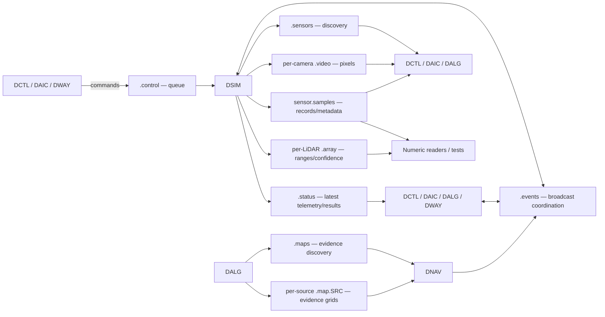

# Shared-memory communication between modules

DSIM creates and owns all named shared-memory areas in the current simulator
workflow. Clients open those areas; they do not create private reply queues or
publish their own video/status areas. There are two exceptions. In *writing
authority*, `.events`: DSIM creates the ring, but every module publishes its own
events. In *ownership*, the evidence plane (`.maps` and its per-source rings) and
the optional imagery plane (`.imagery` and its per-image rings): their producer
creates and owns each, because a producer owns its plane and DSIM has
nothing to say about what a module believes. The imagery plane is a third
exception in *consumption*: nothing operational reads it at all -- it is
display decoration for UI hosts and report rendering (see
[DV-MAPPING.md](../DV-MAPPING.md) §7 and §9).

This guide describes the implemented transport, including names, contents,
readers, writers, buffering, and recovery. [modcom.md](modcom.md) provides the
broader module contracts; [clock.md](clock.md) explains time, and
[recovery.md](recovery.md) records recovery requirements and deferred guarantees.
The dormant FlightGear provider is covered separately below.

## Complete buffer inventory

Let `I` be the instance ID, `S` the provider's lowercase 32-hex-digit UUID,
`G` the sensor generation, and `ID` a sensor ID. Every name below is a POSIX
shared-memory name, including the leading `/`. On Linux it normally appears
under `/dev/shm/` without that leading slash; this is shared memory, not a
repository file used as a message transport.

| Name | pymembus type | Created/written by | Read by | Contents |
|---|---|---|---|---|
| `/dvision2.I.control` | `memcmd` | DSIM creates; DCTL, DAIC, DWAY and command test clients write | DSIM only | Vehicle commands and control-lease requests |
| `/dvision2.I.status` | `memkv` | DSIM | DCTL, DAIC, DWAY and test clients (not DALG or DNAV) | Retained vehicle telemetry, capabilities, command outcomes, simulator diagnostics |
| `/dvision2.I.context` | `memkv`, one JSON snapshot | The session provider (DSIM, or `dtest/provider.py`) creates and owns it; goal authorities and mapping-reset requesters write their fields under a host `flock` | DALG, DNAV, `dcmn.context show` | Session id and report root, frame and localization/clock epochs, data clock, labelled ideal pose, goal and its authority, mapping-reset request, recent transition history |
| `/dvision2.I.events` | `memmsg`, text | DSIM creates; all participating modules write | All participating modules | Module presence, health, run coordination and instance shutdown |
| `/dvision2.I.sensors` | `memkv` | DSIM's `SensorPublisher` | Camera/numeric consumers and inspection tools | Atomic sensor manifest, profile digest and transport identities |
| `/dvision2.I.sS.gG.sensor.samples` | `memmsg`, bytes | DSIM's `SensorPublisher` | Camera consumers and `SensorSamples` readers | Multiplexed compact measurements and camera/LiDAR capture metadata |
| `/dvision2.I.sS.gG.sensor.ID.video` | `memvid`, RGB24 | DSIM, one per enabled RGB camera | Consumers selecting that camera | Image pixels, frame sequence and presentation timestamps |
| `/dvision2.I.sS.gG.sensor.ID.array` | `memmsg`, bytes | DSIM, one per enabled LiDAR sensor | `SensorSamples` or a future LiDAR consumer | Packed ranges and confidence arrays |
| `/dvision2.I.maps` | `memkv` | DALG's `MapPublisher` | DNAV and `dcmn.maps --dump` | Atomic evidence-grid manifest (schema v2): runtime geometry, the generation's frame, localization/clock/mapping epochs and geometry revision, cadence and staleness horizon |
| `/dvision2.I.mS.gG.map.SRC` | `memmsg`, bytes | DALG, one per evidence source | DNAV and map-pane consumers | Complete occupancy-evidence grids, payload type 110 |
| `/dvision2.I.imagery` | `memkv` | The imagery publisher (DSIM's, or `dtest/provider.py`'s, `ImagePublisher`) | `dcmn.imagery.ImageSession` readers: UI hosts and report rendering only, never DALG or DNAV | Atomic imagery manifest (schema `dvision2.imagery-manifest.v1`): provider session, generation, the size limits, and one entry per published image |
| `/dvision2.I.iS.gG.image.ID` | `memmsg`, bytes | The imagery publisher, one ring per published image (at most 16) | `ImageSession` readers | Immutable reference-image revisions, payload type 120: a length-prefixed metadata JSON envelope plus the exact PNG bytes |

Routes travel on `.events` rather than on a plane of their own. A route is a
few kilobytes published about once a second, its consumers are the same modules
already reading that ring, and `route.planned` carries the map revision and
policy digest it was planned against so a follower can judge its freshness
without a second discovery mechanism. It is republished on every re-plan even
when the plan is unchanged, which is what lets a consumer tell "still endorsed
against current evidence" from "the planner stopped".

The context registry is durable latest state: a module that starts late reads
the current goal, session and epochs there rather than relying on having heard
an event. Its schema is `dvision2.context.v1`; a reader refuses any other. The
frame is `local` (x east, y south, z up, metres; compass heading clockwise from
north; altitude datum the provider's ground plane). A pose carries frame,
localization epoch, clock domain and epoch, capture time, sequence, provider,
validity and `uncertainty_state: unknown`; its validity is the pose's, never a
sensor sample's status. Capture-associated sensor records carry the same fields
in a `pose_context` payload entry. Each map record's header `reset_epoch` and
`clock_epoch` carry the generation's mapping and clock epochs, and a consumer
rejects a record that disagrees with its manifest.

There are **`6 + C + A` named areas** in a steady-state instance with no
evidence producer (the sixth is the context registry), where `C` is the number of enabled RGB cameras and `A` the
number of enabled LiDAR sensors; a running producer adds `1 + M` more, one
registry and one ring per published source. Six names are stable; the compact
ring, the camera/array rings and the map rings are qualified by session and
generation. Old and new sensor areas coexist briefly during Apply. Disabled
sensors and mount/rig/PTZ nodes allocate no individual area.

The maps plane uses `m` where the sensor plane uses `s` in its session prefix,
so the two cannot collide even when a sensor and an evidence source share an
id. Its rings **do not inherit the 8192-byte compact-record cap**: each declares
its own `record_bytes` from the profile's declared extent, which for a 200x200
grid is about 200 KB.

The imagery plane uses `i` in its session prefix, so its rings cannot collide
with either. A dsim that publishes reference imagery adds `1 + R` more areas --
one registry and one ring per image, at most 16 images -- and `--no-imagery`
adds none. Each image ring is sized from that image's first revision and never
grows: a producer whose image outgrew its own staging is told to withdraw and
publish again rather than the plane inventing a second, quieter bound.

For the default profile, this is **7 areas**: the five stable names, one shared
sample ring and the `front` video ring. Its GNSS, IMU, barometer, compass and
temperature sensors all use that one sample ring. The committed
`stereo-nav-and-proximity` profile has **10 areas**: five stable names, one compact
ring, two video rings and two LiDAR rings. Its three rangefinders add records,
not areas. Profiles may change these counts.

An example camera name is:

```text
/dvision2.area1.s0123456789abcdef0123456789abcdef.g1.sensor.front.video
```

Consumers must discover the actual name from the manifest. Do not construct a
camera name using an assumed session, generation, or primary-camera ID.
Instance and component IDs use `[A-Za-z0-9_.-]+`; component IDs are limited to
48 ASCII bytes and complete shared-memory names to 254 bytes. `body` is reserved.

## Who talks to whom



| Module | Reads | Writes | Role on `.events` |
|---|---|---|---|
| DSIM | Control queue; module events | All status, discovery, pixels, measurements; its own events | `simulator` |
| DCTL | Status; registry; primary RGB and its compact metadata; events | Manual commands, lease maintenance, manual-measurement coordination, intake health | `controller` |
| DAIC, UI and headless | Status; registry; primary RGB and its compact metadata; events | Flight commands, lease maintenance, presence and intake health | `controller` |
| DALG | Status; registry; primary RGB and its compact metadata; events | Algorithm readiness, run outcomes, presence and intake health; **the evidence plane it owns**; **no vehicle commands** | `algorithm` |
| DNAV | Status; the evidence plane; events | Routes, planner presence and health; **no vehicle commands and no control lease** | `planner` |
| DWAY | Status and events; **no camera or numeric sensor rings** | Navigation commands, lease maintenance, tour coordination and presence | `navigator` |
| Test harnesses | Channels needed by each test | Commands and/or coordination events when exercising those contracts | Depends on the test |

DAIC perception, SLAM, planning and avoidance run within DAIC; they do not
exchange additional named pymembus areas. DALG holds no exact-range oracle:
simulated range arrives through the same sensor interface as real range, and
the truth rasters and oracle controls live in the evaluation tooling
(`dtest/evaluation.py`), never in a running module. The imagery plane is the one
area DALG and DNAV never open -- a reference image reaches them only as pixels
in a window or a report, never as an input. Current production RGB consumers
filter the compact ring for their camera metadata; seeing that ring open does
not mean they use its IMU or GPS.

## Buffering and capacity

These primitives have different delivery semantics:

| Primitive | Behavior | Consequence for a reader |
|---|---|---|
| `memkv` | Fixed string keys with retained latest values; DSIM commits with `setAll()` | Use `getAll()` for a coherent snapshot; intermediate updates are not history |
| `memcmd` | Many writers, one vehicle reader | Do not attach an inspection reader: it can consume commands intended for DSIM |
| `memmsg` | Broadcast ring with an independent cursor per reader | Each subscriber can receive the same records; slow readers can overrun |
| `memvid` | Ring of image slots | Copy frames before slot reuse and verify the sequence; camera adapters expose the newest matched frame |

`.control` defaults to **65,536 bytes**, configurable with DSIM's `--cmd-size`.
`.events` defaults to **262,144 bytes** (`PymembusModuleBus.DEFAULT_SIZE`). Its
messages are variable-length JSON, not 8192-byte sensor records; the 8192-byte
limit below applies only to compact sensor records. There is no durable event
history, acknowledgment queue, or delivery retry log in the event ring.

`.status` has one entry per `STATUS_KEYS` item, with up to **4096 bytes per
value**. The name stride is padded for pymembus alignment. `.sensors` has nine
entries and **65,536-byte value capacity**, allowing its manifest to occupy one
value. These capacities are not the size of the entire key/value mapping.

The profile's optional `transport` object controls sensor retention and the
sensor shared-memory ceiling:

```json
{"retention_s": 1.0, "memory_limit_mib": 256.0}
```

Both values must be positive. Resolved defaults are 1 simulated second and
256 MiB. The allocation planner uses the following conservative calculations;
these are planned bytes, not a measurement of process RSS:

| Area | Planning rule |
|---|---|
| Camera | `slots = ceil(rate_hz * retention_s) + 2`; bytes = `slots * (width * height * 3 + 128) + 4096` |
| Compact ring | `max(65536, (ceil(sum_enabled_rates * retention_s) + 2) * (8192 + 64))` |
| Array ring | `record_bytes = 128 + 5 * element_count`; capacity = `max(65536, slots * (record_bytes + 64))` |
| Registry allowance | `10 * (65536 + 64) + 4096` bytes |

Every enabled sensor contributes one compact record per capture, including
cameras and LiDAR, so `sum_enabled_rates` includes them all. Each LiDAR also
writes one packed record to its dedicated ring. Array-ring traffic cannot
consume compact-ring capacity.

The sensor ceiling includes the registry, compact ring, RGB rings and array
rings. During Apply it includes **active plus staged sensor generations**, with
the shared registry counted once. It excludes control/status/event areas,
renderer/GPU memory and consumer copies. Camera intake reports `cache_bytes`
separately: copied image bytes and encoded pending metadata, excluding Python
object overhead. See `transport_plan()` in
[profiles.py](../apps/dsim/profiles.py) for the exact arithmetic.

## Vehicle commands: `.control`

DSIM drains this queue during physics stepping. Each message is compact JSON
with `magic: "dvision2.command.v1"` and a string `type`. Malformed envelopes are
ignored. Controlled messages also carry `source_id`, `lease_id`, and a unique
`request_id`; use the helpers in [dvision2_common.py](../dvision2_common.py).

```json
{"magic":"dvision2.command.v1","type":"velocity","source_id":"dway-area1","lease_id":"opaque-lease","request_id":"opaque-request","forward_mps":0.5,"right_mps":0.0,"up_mps":0.0,"yaw_rate_dps":0.0}
```

| Command | Payload fields beyond the envelope/identity | Effect |
|---|---|---|
| `acquire_control` | `source_id`, `lease_id` | Acquire the single control lease; another active owner prevents acquisition |
| `release_control` | — | Release the caller's lease |
| `heartbeat` | — | Refresh the matching owner's lease; does not refresh the motion setpoint |
| `arm` | `armed` boolean | Arm/disarm; arming captures home |
| `takeoff` | `alt_m` | Take off to a height above map ground |
| `land` | — | Land; the lease-free emergency exception |
| `rtl` | — | Return home and land |
| `zero`, `hold` | — | Clear motion targets and hold when armed |
| `velocity` | `forward_mps`, `right_mps`, `up_mps`, `yaw_rate_dps` | Body-frame velocity target |
| `position_target` | `frame: "map"`, `x`, `y`, `z`; or `frame: "local_ned"`, `north_m`, `east_m`, `down_m`; optional `heading_deg`, `max_speed_mps` | Position target in the specified frame |
| `set_origin` | `lat_deg`, `lon_deg`, `alt_m` | Change geographic datum while disarmed |
| `set_gps` | `mode`, optional `noise_m` | Change simulated GNSS conditions |
| `set_estimator` | Any of `attitude`, `local`, `global`, `velocity` | Change estimator-validity flags |
| `reset` | — | Reset the drone and sensor history while retaining selected hardware |

Motion, mode, reset and configuration commands require the current lease;
`land` is exempt. A heartbeat from a non-owner does not acquire or refresh
ownership. Actual acceptance also depends on armed/crashed state, mode,
estimator validity and configured bounds. Capabilities in `.status` are the
way to check support. DSIM advertises no attitude-command or uploaded-mission
support; DWAY implements missions by sending setpoints.

A successful queue write is **not command acceptance**. DSIM publishes the
latest result in `.status` under `command.result.request_id`,
`command.result.accepted` (`"1"`/`"0"`) and `command.result.reason`. It also
retains the last 16 correlated outcomes in `command.results`, newline-delimited:

```text
request-id 1
another-request-id 0 control lease required
```

The actual line format is `request_id accepted reason`; the reason may be empty.
History reasons are flattened and truncated to 96 characters. Use
`parse_command_results()` rather than treating the value as a JSON array.
The result history prevents commands drained in the same tick from hiding one
another's outcomes. It is bounded and is not a durable deduplication journal:
request IDs correlate results, but do not establish exactly-once execution.
On a queue overrun DSIM reports `command overrun` and skips the affected read.

Control heartbeats, module heartbeats and motion setpoints are three different
messages. A module can remain visible on `.events` while its control lease
expires; a valid control lease can remain alive while stale guided setpoints
trigger a hold. Do not use any one of these as a substitute for another.

## Vehicle telemetry and outcomes: `.status`

All values are strings. Empty string means unavailable where applicable;
boolean flags normally use `"1"` and `"0"`. Read the whole dictionary once with
`getAll()`. The following groups enumerate the current canonical keys:

| Information | Keys |
|---|---|
| Instance, clock and artifacts | `sim.id`, `sim.map`, `sim.time_s`, `sim.report_dir` |
| Pace and diagnostics | `sim.speed`, `sim.speed_achieved`, `sim.health`, `sim.camera_in_geometry` |
| Vehicle capabilities | `vehicle.type`, `vehicle.frames`, `vehicle.accepts_position`, `vehicle.accepts_velocity`, `vehicle.accepts_attitude`, `vehicle.supports_missions`, `vehicle.setpoint_timeout_s`, `vehicle.max_speed_mps`, `vehicle.max_accel_mps2` |
| GNSS quality | `gps.fix_type`, `gps.satellites`, `gps.hdop`, `gps.vdop` |
| Estimator validity | `est.attitude_valid`, `est.local_position_valid`, `est.global_position_valid`, `est.velocity_valid` |
| Wind and fence | `wind.speed_mps`, `wind.dir_deg`, `wind.gust_mps`, `geofence.box`, `geofence.action` |
| Effective realism settings | `realism.telemetry_latency_ms`, `realism.telemetry_jitter_ms`, `realism.sensor_noise`, `realism.battery_failsafe_pct`, `realism.battery_drain_pct_s`, `realism.seed` |
| Geographic datum and home | `origin.lat_deg`, `origin.lon_deg`, `origin.alt_m`, `home.lat_deg`, `home.lon_deg`, `home.alt_m` |
| Authority and failsafe | `control.owner`, `control.lease_age_s`, `control.lease_timeout_s`, `setpoint.age_s`, `failsafe.reason` |
| Command outcomes | `command.result.request_id`, `command.result.accepted`, `command.result.reason`, `command.results` |
| Mode and local pose | `drone.armed`, `drone.mode`, `drone.x_m`, `drone.y_m`, `drone.z_m` |
| GNSS position and map target | `drone.lat_deg`, `drone.lon_deg`, `drone.alt_m`, `target.lat_deg`, `target.lon_deg`, `target.alt_m` |
| Attitude | `drone.roll_deg`, `drone.pitch_deg`, `drone.heading_deg`, `drone.compass_deg` |
| Velocity | `drone.vx_mps`, `drone.vy_mps`, `drone.vz_mps`, `drone.speed_mps` |
| Vehicle health | `drone.battery_pct`, `drone.crashed`, `drone.last_command_s` |
| Link diagnostics | `link.command_count`, `link.last_command_type`, `status.message` |

Map position/velocity use east, south, up; heading is degrees clockwise from
north. `drone.z_m` is altitude above map ground with the altitude error model;
`drone.alt_m` is GNSS altitude above mean sea level. The `target.*` keys describe
the map target exposed by DSIM, not the full current DWAY waypoint plan.
`sim.camera_in_geometry` currently checks the vehicle position against scene
obstacles; it is not an individual camera's production-health record.

DSIM attempts publication each physics tick. The telemetry latency/jitter model
can delay the entire snapshot, including its simulator timestamp. Some fields
carry noisy instrument estimates; map X/Y are currently the vehicle's map
position. A snapshot is internally coherent, but it is **not atomically paired
with a camera or numeric sample**. Use capture records for capture-time truth.
No scalar `camera.*`, `range.config`, or per-temperature/per-LiDAR status keys
are published. Raw measurements live in the sensor channels below.

## Sensor discovery: `.sensors`

The registry has exactly nine keys, committed together using `memkv.setAll()`:

| Key | Value |
|---|---|
| `sensors.schema` | `dvision2.sensor-manifest.v1` |
| `sensors.profile_name` | Resolved hardware profile name |
| `sensors.profile_digest` | SHA-256 of canonical resolved profile JSON |
| `sensors.manifest` | Complete compact JSON manifest |
| `sensors.generation` | Decimal generation, initially 1 |
| `vehicle_id` | Instance ID in the current implementation |
| `provider_session_id` | Fresh provider UUID per process |
| `clock_domain_id` | Instance ID in the current implementation |
| `clock_epoch` | Provider clock-continuity identity |

The manifest includes these identities plus `primary_camera`, the full resolved
`profile`, `profile_digest`, `memory_bytes`, `sample_channel`, `sample_capacity`,
and a `sensors` dictionary keyed by enabled sensor ID. Each entry supplies its
`type`, rate, parent, parent-relative pose, resolved model, sync group and
transport details:

| `transport` | Where to read | Additional metadata |
|---|---|---|
| `video` | `channel` | RGB24 pixel format, calibration revision, compact metadata type/schema |
| `compact` | `channel`, equal to `sample_channel` | Type-specific compact payload type/schema |
| `array` | `channel` | Ring capacity, record size, array layout, calibration, compact metadata type/schema and fidelity limitations |

Mounts and disabled sensors remain in the embedded profile but have no active
entry in the `sensors` dictionary. Calibration lives here; capture poses live in
records. The digest identifies resolved hardware, not a DALG algorithm profile.

## Compact measurements: `sensor.samples`

This is one binary broadcast ring shared by all enabled sensors. The same
`RecordRing` wrapper and binary envelope are used for the dedicated array rings.
Binary APIs are required: `write_bytes()` and `read_bytes_with_overrun()`.
Do not pass these records through the text event codec. The local pymembus
build support is in [build_sensor_pymembus.py](../scripts/build_sensor_pymembus.py).

### Common record envelope

The header is exactly 128 bytes, little-endian, followed by `payload_length`
bytes. Its Python struct format is `<4sHH16sQQQqQQ48sHHI`; no implicit padding is
inserted. Offsets below follow the actual `HEADER` in
[sensors.py](../apps/dcmn/sensors.py).

| Offset | Bytes | Field |
|---|---|---|
| 0 | 4 | Magic `DVS1` |
| 4 | 2 | Envelope version, 1 |
| 6 | 2 | Header size, 128 |
| 8 | 16 | Provider UUID bytes |
| 24 | 8 | Generation, unsigned |
| 32 | 8 | Per-sensor sequence, unsigned; starts at 1 |
| 40 | 8 | Capture ID, unsigned |
| 48 | 8 | Simulated microseconds, signed |
| 56 | 8 | Reset epoch, unsigned |
| 64 | 8 | Clock epoch, unsigned |
| 72 | 48 | ASCII sensor ID, NUL-padded |
| 120 | 2 | Payload type |
| 122 | 2 | Status: 1 valid, 0 invalid |
| 124 | 4 | Payload length |
| 128 | variable | Payload |

A sensor sequence advances for each attempted capture, including failed
production/publication, so gaps are meaningful. LiDAR's array and metadata
share the same sequence. Capture IDs identify a frozen physics snapshot across
sensors due on that tick; they are not camera frame numbers. Sync-group cameras
have identical capture IDs and simulated timestamps, but distinct sensor IDs,
images, and composed poses.

### Payload dictionary

Compact payloads are UTF-8 JSON objects with their own `schema`. Keys are
sorted, whitespace compact, and non-finite JSON numbers forbidden. An invalid
measurement is `null` with explicit validity/status. The **8192-byte maximum
includes the 128-byte envelope**. Each row below is a payload type, not a
separate shared-memory area.

| Type | Schema / sensor types | Information carried |
|---|---|---|
| 1 | `camera.frame.v1`; `camera.rgb` | `video_sequence`, `pose_world`, decomposed `pose`, frozen `body`, `calibration_revision`, `sync_group` |
| 2 | `range.sample.v1`; `range.infrared`, `range.ultrasonic`, `range.laser` | Sensor `type`, `range_m` or null, normalized `confidence` (0–1), `returns`, `samples`, `reducer`, min/max range, composed pose and frozen body |
| 3 | `lidar.frame.v1`; `lidar.scan2d`, `lidar.range_image` | `array_sequence`, sensor `type`, valid-return and total-sample counts, calibration, min/max range, composed pose and frozen body |
| 4 | `gnss.sample.v1`; `position.gnss` | `lat_deg`, `lon_deg`, `alt_m` (AMSL), `vel_north_mps`, `vel_east_mps`, `vel_down_mps`, fix type, satellites, HDOP/VDOP, `error_north_m`, `error_east_m`, `error_up_m`, validity |
| 5 | `imu.sample.v1`; `motion.imu` | `angular_rate_dps` and `specific_force_mps2`, each an `{x,y,z}` object; `gravity_mps2`, validity |
| 6 | `barometer.sample.v1`; `altimeter.barometric` | `altitude_m` above map ground, `pressure_pa`, `sea_level_pressure_pa`, validity |
| 7 | `magnetometer.sample.v1`; `heading.magnetometer` | `heading_deg` (clockwise from north), validity |
| 8 | `temperature.sample.v1`; `environment.temperature` | `temperature_c`, validity |

Camera/ray `pose_world` maps sensor forward/right/up coordinates **into map
world coordinates**, as a nested row-major 4×4 matrix. `body` carries map
position, attitude/heading and velocity frozen for capture. Static
`pose_parent` is relative to the named parent and is composed through all mounts.
Camera optical axes are right/down/forward; optical `(x,y,z)` maps to sensor
body `(z,x,-y)` before applying the composed transform. IMU vectors are in
sensor axes; a stationary level IMU reads approximately +9.80665 m/s² on Z.

State-sensor records do not include a separate truth pose/body block. GNSS
explicitly includes its simulated error components. Consult the
[per-sensor documents](sensor/README.md) for model defaults, sign conventions,
noise and fidelity; the transport does not imply a closed-loop estimator.

## RGB pixels: each `sensor.ID.video`

A video ring stores top-left-origin RGB24 images of the manifest's dimensions.
It also stores the exact frame sequence and VPTS/APTS timestamps, both integer
simulated microseconds. Pixels do not contain the composed pose or full
calibration. The matching `camera.frame.v1` record supplies those associations.

Publication order is:

1. Render the view into its camera's writable slot from the frozen snapshot.
2. Set VPTS/APTS, advance the video ring, obtain the committed frame sequence.
3. Publish compact metadata naming that exact `video_sequence`.

A reader matches `(provider_session_id, generation, sensor_id, video_sequence)`.
Video may be visible before its metadata. `SensorVideo` copies unmatched pixels
into a bounded pending cache and only exposes matched frames. It checks slot
sequence before and after copying to detect slot reuse. Pending caches use
`ceil(rate_hz * retention_s) + 2` entries. Eviction and lifecycle changes count
association drops; there is no cross-area lock or distributed transaction.

DCTL, DAIC and DALG use `SensorVideo`/`open_camera()` to select the manifest's
primary camera. Explicit camera selection is also available through the adapter.
Its `capture_status()` may produce local `camera.*` dictionary keys for existing
algorithms; these are derived in process and are **not shared status keys**.

## LiDAR arrays: each `sensor.ID.array`

A LiDAR capture writes two associated records: compact type 3 metadata on
`sensor.samples`, and type **100** packed data on its dedicated array ring.
The array uses the common 128-byte envelope, followed by:

```text
N contiguous little-endian float32 ranges in metres
N contiguous uint8 confidence values
```

This is two packed blocks, not interleaved `(range, confidence)` structs. The
payload is `5 * N` bytes. Invalid rays contain float32 NaN and confidence 0.
Confidence occupies 0–255; the linear confidence model can also round a valid
near-limit return to 0, so test range finiteness to determine ray validity.
Binary NaN is intentional here and does not relax
the strict-JSON rule for compact records. An array with no valid returns has
invalid envelope status. Match metadata and array by session, generation,
sensor ID and sensor sequence/`array_sequence`, also checking capture/time.

| Sensor type | Shape | Calibration |
|---|---|---|
| `lidar.scan2d` | `[samples]` | `angle_min_deg`, `angle_increment_deg`, `samples`, `elevation_deg` |
| `lidar.range_image` | `[height_px, width_px]`, row-major | Width, height, `fx_px`, `fy_px`, `cx_px`, `cy_px` |

Scan angles increase toward sensor right. A full 360° scan starts at −180° and
steps by `360 / samples`, without repeating the endpoint. A partial scan
includes both endpoints, stepping by `fov / (samples - 1)`. Ranges are slant
ranges, not camera-axis depths. The manifest `layout` declares dtypes/shapes;
use `unpack_array()` or `SensorSamples.drain_array()` to interpret it.

The manifest also records material-independent LiDAR, no multiple returns and
no scan motion distortion. No point-cloud buffer is created in this version.

## Optional reference imagery: `.imagery`

An optional plane for decoration a human looks at: a surveyed plan, a floor
plan, a simulator's rendering of its own world. DSIM publishes one such image
of the loaded map (`--no-imagery` skips the plane entirely), `dtest/provider.py`
publishes its fixture scene, and a hardware provider would publish its own
surveyed imagery the same way -- the publisher is the extension point, and
nothing else in the stack has to change. Consumers are UI hosts and report
rendering, and nobody else: DALG and DNAV never open this plane, an image is
never converted into occupancy or cost, and its presence or absence is not a
readiness input to anything. Satellite projection and tile streaming remain
deferred; a published image is one whole PNG with one placement.

A producer owns an `ImagePublisher`, which commits an atomic manifest to
`.imagery` and writes each image's revisions to that image's ring, payload
type 120: a 4-byte little-endian length, the metadata JSON, then the exact PNG
bytes. A revision is immutable once published; republishing the same image and
placement is a heartbeat, and a changed one advances the revision. Images
attach and withdraw within a producer's lifetime, and a new producer session
or generation is a wholesale rediscovery -- a reader abandons the old images
rather than trusting a departed producer's placement. Discovery is late by
design: a consumer that attached before the first publish finds it on its next
probe.

The metadata is derived by the publisher, never asserted by the caller, and a
consumer re-verifies every record: schema, encoding, dimensions, checksum
(sha256 of the PNG bytes), a non-singular full 2D affine, and the frame
identity. Placement is `[a,b,c,d,e,f]` with `x = a·col + b·row + e`,
`y = c·col + d·row + f` -- pixel (0,0) is the top-left pixel *centre*,
columns run right, rows run down, and a reflection (negative determinant) is
legitimate and is never silently un-mirrored. A cell whose centre falls
outside the image's footprint -- the affine applied to the rectangle
`(-0.5, -0.5)` to `(width-0.5, height-0.5)` -- keeps its ground colour: an
image is clipped, never stretched. An image is retained only while its frame
id, localization epoch and clock epoch still match the session context; after
a discontinuity there is no background, and an unchecked context matches
nothing.

The budgets are part of the contract: at most 16 MiB encoded and 64 MiB
decoded per image, at most 16 images per plane, and a consumer caches at most
the current revision plus one staged predecessor of each image -- accounted
separately from the mapping memory budget. A record that fails any check is
rejected with a message and displaces nothing; an invalid replacement never
evicts the revision it was trying to replace, and the only things that remove
a good image are withdrawal, a producer restart, or the frame moving on.
Reference images are archived with the report that displayed them, referenced
by checksum (see [reports.md](reports.md)).

Verification: [imagery contract](../tests/test_dcmn_imagery.py) -- the affine
under translate/rotate/reflect/unequal scale, malformed and lying records,
budget exhaustion, frame epochs, provider restarts, and the three-background
numeric-identity run (no image, a correct one and a misleading one produce
the same evidence and the same routes).

## Module coordination: `.events`

Each `PymembusModuleBus` endpoint opens the same 256 KiB broadcast ring with its
own read cursor. Each module can publish and receive; DSIM is neither an event
broker nor the sole event writer. Messages are compact JSON with this envelope:

```json
{
  "magic": "dvision2.module.v1",
  "schema_version": 1,
  "event_id": "unique-event-UUID",
  "instance_id": "area1",
  "source": {"role": "algorithm", "implementation": "dalg", "process_id": "process-UUID"},
  "sequence": 1,
  "sim_time_s": 12.0,
  "type": "run.ready",
  "run_id": "shared-run-id",
  "payload": {"profile": "sgbm-baseline", "algorithm": "sgbm"}
}
```

`process_id` is a process-lifetime UUID, distinct from provider sensor session
and mission/run ID. Sequence is local to the publishing endpoint. Receivers
filter instance/version and deduplicate recent event IDs in memory. Payloads
vary by event and implementation; absence of a field is not an affirmative
capability or readiness declaration.

| Event | Typical publisher | Payload / purpose |
|---|---|---|
| `module.hello` | DSIM, DAIC, DALG, DWAY | Presence and capability snapshot; DCTL currently advertises itself via heartbeats |
| `module.heartbeat` | All five modules | Current state, optional `ready`, capabilities and processing `intake`; DALG also reports algorithm profile/digest |
| `module.goodbye` | DSIM, DALG, DWAY on orderly teardown | Departure/state; modules that do not send it are removed through expiry |
| `module.sensor_health` | DCTL, DAIC, DALG | Module state and `sensor_inputs` keyed by active input sensor ID |
| `run.prepare` | DWAY tour coordinator or DCTL manual coordinator | Requested participant roles/selectors and run configuration; DWAY includes tour/map digests and coordinate frame |
| `run.ready` | DALG | Matching profile/algorithm, capabilities and configuration digest for the named run |
| `run.reject` | DALG | Reason a run/configuration cannot be accepted |
| `run.start_scheduled` | DWAY or DCTL | Absolute `start_sim_time_s` |
| `run.started` | Coordinator and DALG | Actual transition into the scheduled run |
| `run.state` | DWAY or DCTL | Current run state/start time; tour waypoint progress or manual-flight mode |
| `run.completed`, `run.aborted` | Coordinator and DALG | Terminal state, outcome/reason and implementation-specific report details |
| `system.shutdown` | DSIM's instance shutdown action | `scope: "instance"`, reason; all receiving modules stop regardless of run ID |

For a coordinated run, the coordinator repeats preparation, collects matching
readiness for the exact run, publishes an absolute simulator start time, then
publishes state and terminal outcomes. DALG can join a DWAY tour or a DCTL
manual measurement without writing flight commands. Readiness and terminal
events must be matched by run and source, not by whichever message arrived last.

A sensor-health input carries `generation`, `required`, `expected_hz`,
`observed_hz`, `last_sequence`, `age_s`, `skipped`, `overruns`, `drops`,
`cache_bytes`, `sync`, and `state`. DSIM retains these in its local
`PipelineView`. The worst required input contributes to module health; an
optional input does not degrade the summary. A healthy left camera must not
hide a failed or capture-diverged required right camera.

DSIM's own per-sensor production counters, costs, drops and faults are currently
held **inside DSIM**, displayed in its UI and written to its health/run reports.
They are not a second shared-memory health registry or a producer
`module.sensor_health` broadcast. `.status` publishes only aggregate `sim.health`
and speed diagnostics. Consumers report their own intake, not DSIM's counters.

## Time, lifecycle and failure behavior

Sensor cadence runs on fixed physics ticks (300 Hz by default). Each enabled
sensor rate must divide the physics rate; due sensors share a frozen snapshot.
Sample `sim_time_us` is authoritative for capture timing. Retained status time
can be delayed. A module event's `sim_time_s` is supplied by its endpoint's
clock callback; DSIM/DCTL/DALG/DWAY use simulator-related clocks, while DAIC's bus
uses the default local monotonic callback. Do not assume the envelope field
alone establishes cross-module capture simultaneity. Scheduled run starts use
explicit simulator time in `start_sim_time_s`.

Presence expiry uses wall-monotonic receipt time, with a default 3-second
`PipelineView` expiry. Camera consumers publish sensor-health events about once
per wall second. DSIM and DWAY currently schedule their module heartbeats from
simulator time; slow or paused simulated time can therefore affect their
wall-time presence grade. This is an implementation distinction, not a reason
to timestamp sensor samples with wall time.

| Transition | What happens to shared memory and identities |
|---|---|
| DSIM startup | Creates/replaces stable provider areas; fresh sensor session and clock epoch, generation 1; only ready channels are advertised |
| Disarmed profile Apply | Prepares renderer resources and new generation channels; atomically commits the registry last; unlinks old sensor names; stable control/status/events remain |
| Failed profile validation/allocation | Keeps the working profile/generation; staged resources are discarded |
| Drone reset | Keeps sensor session, generation, names, sequences, capture IDs and simulated time; increments reset epoch and restarts sensor cadence/history |
| Consumer restart | Reopens stable discovery and current channels; cannot recover samples already overwritten |
| Provider restart | Same stable instance names can refer to new areas; session-qualified sensor names change; consumers must reopen and discard old transport state |
| Orderly DSIM close | Publishes goodbye, explicitly unlinks its sensor registry/data areas, and closes control/status/event handles; startup explicitly removes the stable control/status/event names before recreating them |
| Hard process crash | Cleanup may not run; names or old readable mappings can remain. Readability alone does not prove a live provider |

Unlinking a POSIX name does not revoke already-open mappings. SensorVideo probes
the registry at most every 0.25 wall seconds; new identity, camera removal or
registry disappearance clears stale intake. Camera reset metadata invalidates
history. Event endpoints probe the stable event name about once per wall second
and compare the ring session. Existing consumers also have their own reconnect
and failure handling; consult their link code and [recovery.md](recovery.md).

Overruns, sensor sequence gaps and association drops are different metrics.
None provides retransmission or durable delivery. A reconnect does not restore
control authority, recover an uncertain command outcome, or automatically resume
a mission. In particular, the current 16-result history does not implement the
durable command journal described as future recovery work.

## Inspecting a running instance without changing it

From the repository root, the following script opens existing key/value areas
and lists every advertised active sensor channel. It creates no areas and sends
no commands:

```python
import json
from dvision2_common import load_pymembus, shared_names

pm = load_pymembus()
names = shared_names("area1")
for key in ("status", "sensors"):
    kv = pm.memkv()
    if not kv.open(names[key]):
        print(names[key], "unavailable")
        continue
    try:
        values = kv.getAll()
    finally:
        kv.close()
    if key == "status":
        print(names[key], json.dumps(values, indent=2))
    else:
        manifest = json.loads(values["sensors.manifest"])
        print("session", manifest["provider_session_id"], "generation", manifest["generation"])
        print("compact", manifest["sample_channel"], manifest["sample_capacity"])
        for sensor_id, entry in manifest["sensors"].items():
            print(sensor_id, entry["type"], entry["transport"], entry["channel"])
```

For decoding examples, add `apps` to `PYTHONPATH` and use
`dcmn.sensors.SensorVideo` or `SensorSamples`. `SensorSamples.drain()` reads
compact records and `drain_array(sensor_id)` reads a LiDAR's dedicated records.
These have independent broadcast cursors. Close handles when finished.
Never use `create=True`, `remove()`, or drain `.control` merely to inspect a run.

DSIM writes `drone-profile.json`, `sensor-manifest.json`, `sensor-plan.json`,
`summary.json`, health artifacts and evaluator-only `truth/` under its report
directory. These are useful post-run evidence but are not live IPC. The
context's `report_root` (and, for status-plane clients, `sim.report_dir`) lets
other modules place their own artifacts in the same run tree. Profile/map/tour files and
renderer's local buffers are likewise not additional pymembus channels.

## Dormant provider and absent channels

`apps/dfgb/dfgb.py` retains the older FlightGear bridge implementation. It
references a single `.video` area plus control/status/events, but current
`shared_names()` no longer supplies `video`. It has not been migrated to the
sensor registry and must not be treated as a working provider of this guide's
contract. It also lacks DSIM's full lease, result and capability semantics.
Its FlightGear-facing connections are outside the current inter-module sensor
transport. DSIM and DFGB must not be run as competing owners of one instance.

The current DSIM workflow creates no legacy `/dvision2.I.video`, per-module
status/reply buffers, point-cloud buffers, dedicated GPS/IMU/temperature rings,
SLAM-result rings, or separate PTZ-control buffer. Local Sensors-tab Apply/PTZ
editing does not add a new command channel. New modules should use the existing
registry, sensor envelopes and event/control contracts rather than inventing
names based on absent historical interfaces.

## Code and verification map

| Concern | Implementation | Relevant verification |
|---|---|---|
| Stable names, status schema, command codec/results | [dvision2_common.py](../dvision2_common.py) | [vehicle contract](../tests/test_dway_vehicle_contract.py) |
| Area creation, command application, telemetry and cleanup | [dsim.py](../apps/dsim/dsim.py) | [process transport](../tests/test_dvision_process_transport.py), [crash/reset](../tests/test_dsim_crash_reset.py) |
| Sensor names, registry, envelope and readers | [sensors.py](../apps/dcmn/sensors.py) | [sensor contract](../tests/test_sensor_contract.py) |
| Allocation sizes and validation | [profiles.py](../apps/dsim/profiles.py) | [release/lifecycle](../tests/test_sensor_release.py) |
| Capture scheduling and payload publication | [sensor_manager.py](../apps/dsim/sensor_manager.py) | [stereo](../tests/test_sensor_stereo.py), [state sensors](../tests/test_sensor_state.py) |
| The one simulator-shaped seam under scheduling | [sensor_backend.py](../apps/dcmn/sensor_backend.py), [dsim backend](../apps/dsim/backend.py) | [sensor backend](../tests/test_sensor_backend.py) |
| Array layout and physical models | [sensor_models.py](../apps/dsim/sensor_models.py), [state_sensors.py](../apps/dsim/state_sensors.py) | [geometry](../tests/test_sensor_geometry.py) |
| Broadcast events and presence projection | [module_bus.py](../apps/dcmn/module_bus.py) | [module bus](../tests/test_module_bus.py) |
| Intake health and aggregation | [health.py](../apps/dcmn/health.py), [DSIM health](../apps/dsim/health.py) | [sensor health](../tests/test_sensor_health.py) |
| Tour/manual coordination and algorithm participation | [DWAY](../apps/dway/dway.py), [DCTL](../apps/dctl/dctl.py), [DALG](../apps/dalg/run.py) | [DWAY process](../tests/test_dway_process.py), [DALG process](../tests/test_dalg_process.py) |
| Session context: provider ownership, pose, goal authority, resets | [context.py](../apps/dcmn/context.py) | [context](../tests/test_dcmn_context.py), [dalg runtime](../tests/test_dalg_runtime.py) |
| Optional reference imagery: publisher, manifest, records, display session | [imagery.py](../apps/dcmn/imagery.py), [map_pane.py](../apps/dcmn/map_pane.py) | [imagery contract](../tests/test_dcmn_imagery.py) |
| Reference-image archiving and standalone report rendering | [archive.py](../apps/dcmn/archive.py) | [imagery contract](../tests/test_dcmn_imagery.py), [archive](../tests/test_dcmn_archive.py) |

This inventory describes the implementation as inspected on 2026-09-11. Wire
changes should update this guide together with `STATUS_KEYS`, the registry/
envelope constants, and the corresponding contract tests.

## Navigation observation endpoints

Dynamic routes use the single-writer `navigation.<planner-name>` (dnav) and
`execution` (dway, in dry run or flight) retained JSON endpoints under `/dvision2.<id>`. Each uses one atomic 64 KiB snapshot;
complete executable proposals are bounded to 256 points and never truncated.
See [navigation protocol](navigation.md) for ownership, sessions, stop generations,
examples, dry-run and flight semantics. These endpoints do not carry vehicle
commands: dway flies through its own `.control` lease like any other client.
